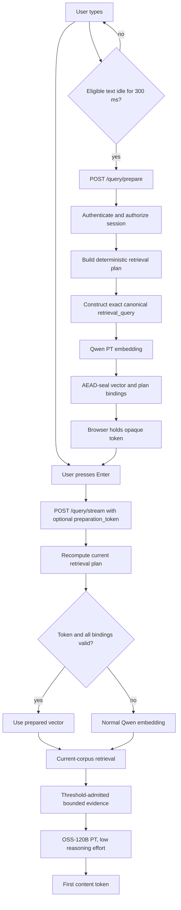

# Speculative Query Preparation

Status: proposed production design
Issue: [#221](https://github.com/Hussain0327/amneal/issues/221)
Last updated: 2026-08-13
Scope: interactive Ask query preparation, retrieval, and synthesis latency

## Decision

RegWatch will move query embedding outside the post-submit critical path by
preparing it while the user is still composing the question.

The prepared input MUST be the exact canonical `retrieval_query` that the normal
Ask pipeline would embed. It MUST NOT be the raw textarea value. The canonical
query depends on deterministic product and form resolution, current session
state, active filters, and follow-up rewriting. Reusing a vector for any other
query would be a retrieval correctness failure, not a performance miss.

Version 1 prepares only:

1. the canonical retrieval-query digest; and
2. its 1024-dimensional Qwen embedding.

It does not prepare retrieval candidates, evidence, or an OSS prompt containing
evidence. Retrieval always executes after submit against the current corpus.
This keeps corpus and index invalidation out of the first release.

The optimization is successful when at least 70% of submitted retrieval turns
already have a valid vector at Enter. On those turns, post-Enter embedding
latency is zero even if the underlying Qwen call still takes 200 ms.

## Why this design

The original latency budget in #221 measured Qwen3-Embedding-0.6B at 965 ms p50
and 1,413 ms p95 for a single short query. Later controlled probes found a broad,
time-varying distribution with a fast mode near 175-250 ms and a delayed mode
that regularly exceeded one second. The custom model-service alias, the system
model, and the raw serving endpoint did not show a repeatable latency advantage.
Changing the requested output dimension from 1024 to 256 also did not reduce
latency.

The production code already uses a shared connection-pooled HTTP client. The
remaining large variance is consistent with admission, scheduling, and dynamic
batching in shared pay-per-token capacity. Provisioned throughput is the
platform control for making that capacity more predictable, but it does not
make a remote model call free. Speculative preparation hides that call behind
time the user was already spending composing the question.

The post-submit latency equations become:

```text
preparation hit:
    Enter-to-token = retrieval + OSS TTFT

preparation miss:
    Enter-to-token = residual Qwen + retrieval + OSS TTFT
```

With a 300 ms debounce and a warm Qwen latency near 200 ms, the vector can be
ready about 500 ms after the last edit. A natural pause before Enter hides the
entire call.

## Goals

- Remove Qwen from the post-Enter critical path on at least 70% of eligible Ask
  submissions.
- Preserve byte-for-byte canonical query construction and current retrieval,
  refusal, citation, and audit behavior.
- Make every preparation failure a safe optimization miss that falls back to
  the existing path.
- Keep prepared state portable across Fly workers without adding Redis or a new
  database table.
- Stabilize Qwen and OSS latency with side-by-side provisioned-throughput
  canaries before any production cutover.
- Bound speculative work so it cannot saturate the capacity reserved for real
  submissions.
- Record performance and outcome metrics without recording partial draft text.

## Non-goals for version 1

- Speculative vector search, reranking, evidence selection, or generation.
- A semantic cache that reuses a vector from a similar but non-identical query.
- A shared persistent embedding cache.
- Changing the Qwen model, vector dimension, instruction, profile geometry, or
  retrieval threshold.
- Changing retrieval ranking, enabling the reranker, or recalibrating #218 as
  part of the latency work.
- Generating an answer before the user submits the question.
- Updating the existing pay-per-token model-service aliases in place.

## Correctness invariants

The implementation is not complete unless all of these remain true.

1. Product and form scope are resolved before semantic retrieval.
2. A contentless follow-up such as `why?` is embedded only after the existing
   deterministic follow-up rewrite has re-anchored it when appropriate.
3. The server recomputes the current canonical retrieval plan at submit. The
   client cannot assert that a prepared vector is valid.
4. The prepared query digest, session revision, filters, origin, embedding
   profile, model revision, dimension, instruction version, and rewrite version
   must all match before reuse.
5. A token validation failure never fails the Ask turn. It records a content-free
   miss reason and runs the normal Qwen path.
6. Retrieval executes against current database state after Enter.
7. Prepared vectors receive the same finite-value, dimensionality, and unit-norm
   validation as fresh provider responses.
8. Preparation creates no conversation message, session mutation, query audit
   row, answer, citation, or user-visible regulatory claim.
9. Every submitted query still produces exactly one normal audit outcome.
10. Disabling the feature restores the current request path without data repair.
11. Token validation uses the pre-turn session snapshot. The submitted turn's
    own session touch and user-message write cannot invalidate its preparation.

## Target architecture



## Phase 0: provision side-by-side capacity

Create new endpoints without changing the existing production aliases.

| Logical target | Initial state | Purpose |
|---|---|---|
| `qwen-p2t` | existing | rollback and control arm |
| `qwen-pt` | new, 50 model units | interactive query embedding canary |
| `oss-p2t` | existing | rollback and control arm |
| `oss-pt` | new, 50 model units | interactive synthesis canary |

The current Unity Catalog model services are pay-per-token routing objects. They
cannot be updated to use provisioned-throughput destinations. The PT targets
therefore have distinct serving endpoint names and are queried directly through
their supported OpenAI-compatible interfaces.

The workspace optimization-info API reported both
`system.ai.qwen3-embedding-0-6b/1` and `system.ai.gpt-oss-120b/1` as
`optimizable=true` with `model_unit_chunk_size=50` on 2026-08-13. Endpoint
creation is still a canary operation: workspace permission, regional GPU
capacity, final cost, and READY state must be checked before use.

### Capacity isolation

The Qwen PT canary is for interactive query traffic. Bulk corpus ingestion MUST
remain on pay-per-token capacity or use separately controlled capacity during
this phase. A batch backfill must not be able to queue a user's prepared or
post-submit query.

Today `QWEN_EMBEDDING_*` config selects one provider for both query and document
embedding. Add a query-only route such as `QWEN_QUERY_BASE_URL`,
`QWEN_QUERY_MODEL`, and `QWEN_QUERY_TOKEN`, defaulting to the existing embedding
settings while the feature is off. `embed_query()` may use the PT route only
after canary acceptance; `embed_documents()` and backfill keep their existing
route. Both routes must still prove the same immutable model revision,
dimension, normalization, instruction, preprocessing, and serving-runtime
contract required by the active profile.

Do not treat a different endpoint name as a different vector space, and do not
silently treat it as equivalent either. Endpoint routing identity must be kept
separate from model/geometry identity. Accept the PT query route for the active
profile only after same-input vector comparison and item-level retrieval parity
show it serves the declared model contract. If it does not, the change requires
a new embedding profile and corpus backfill and is outside this V1 rollout.

The application does not cut over merely because an endpoint reaches READY. It
first verifies:

- the expected served model and revision;
- 1024 output dimensions, finite values, and unit norm;
- rank and citation parity against the active embedding profile;
- concurrency 1, 2, 4, and 8 latency distributions from the Fly region;
- p50, p95, p99, error rate, and 429 rate;
- sustained capacity below the queueing knee; and
- cost per hour and cost per completed Ask turn.

Use the real instructed query shape for Qwen and the real
`GROUNDED_QA_SYSTEM_V7` plus bounded evidence fixture for OSS. Run at least 30
warmup calls and 500 measured requests per primary low-concurrency arm. Preserve
request order randomization between PT and pay-per-token controls.

### Latency experiment

Reserved capacity does not have a known intrinsic distribution until the PT
canaries exist. Measure it rather than inferring it from model size or advertised
throughput.

For Qwen, record full round-trip latency for a fixed representative set of
instructed queries at concurrency 1, then repeat at 2, 4, and 8. Separate the
following arms:

- one reused connection-pooled client matching production from the Fly region;
- a fresh-connection diagnostic arm to quantify DNS, TLS, and connection setup;
- PT versus pay-per-token, randomized within the same time windows; and
- short, medium, and maximum-supported query-length buckets.

For OSS, use the production system prompt, the same fixed admitted-evidence
fixture, `temperature=0.0`, `reasoning_effort=low`, and streaming enabled.
Measure request-to-first-response-byte, request-to-first-non-empty
`delta.content`, and completion separately. First content is the user-visible
TTFT metric; a reasoning or empty stream frame does not stop that clock.

Publish sample count, p50, p75, p90, p95, p99, minimum, maximum, mean, standard
deviation, error/429 counts, and a histogram for every arm. Plot latency against
concurrency and PT utilization so the queueing knee is visible. Where Databricks
exposes server-side execution or queue metrics, record them beside client
round-trip latency; do not label an end-to-end measurement as pure model compute.

The primary comparison uses long-lived connections from the production region
because that is the latency users experience. The diagnostic arms explain the
distribution but do not replace the production-path result.

No endpoint update, alias change, or production environment flip occurs in this
phase.

## Phase 1: split retrieval at the vector boundary

The current Ask pipeline resolves scope and constructs `retrieval_query` in
`generate/grounded_qa.py`. `retrieve()` then selects the active embedding
profile, calls `embed_query()`, and performs vector search.

Refactor this into one authoritative planning path and two execution paths:

```python
plan = prepare_retrieval_plan(
    question=question,
    session_snapshot=session_snapshot,
    request_filters=filters,
    origin=origin,
)

vector = embed_retrieval_query(plan)
passages = retrieve_with_vector(plan=plan, vector=vector, k=k)
```

Keep a compatibility wrapper for every caller that does not supply a prepared
vector:

```python
def retrieve_prepared_or_fresh(plan, *, prepared_vector=None, k=None):
    vector = prepared_vector or embed_retrieval_query(plan)
    return retrieve_with_vector(plan=plan, vector=vector, k=k)
```

The names are illustrative. The required property is that both `/query/prepare`
and the submitted query use the same canonical plan builder. Do not duplicate
product resolution or follow-up rewrite logic in the API route.

### Retrieval plan contents

The immutable server-side plan should contain at least:

- exact canonical `retrieval_query`;
- canonical filters and resolved product scope;
- retrieval mode;
- active embedding profile ID and fingerprint;
- configured model and served revision contract;
- dimension and normalization contract;
- query-instruction version;
- retrieval-query rewrite version;
- session revision and origin; and
- requested wide-net `k`, where relevant to submitted retrieval.

The raw canonical query remains server-side. The sealed token carries its digest,
not the text.

## Phase 2: add `POST /query/prepare`

The endpoint is authenticated and session-authorized like the submitted query,
but it is explicitly non-committing.

### Request

```json
{
  "question": "What fasting duration does FDA recommend?",
  "filters": {
    "normalized_name": "example drug"
  },
  "session_id": "optional-session-id",
  "origin": "thread"
}
```

The question uses the same length and scalar-filter validation as `QueryRequest`.
Unknown filter keys are dropped by the same boundary contract. `origin` uses the
same allowlist as submitted queries.

Version 1 may initially enable preparation only for the main Ask thread surface.
The Research Assistant surface remains on the normal path until its separate
session lifecycle is covered by the same tests.

### Processing

1. Authenticate the user.
2. Apply the dedicated preparation rate and concurrency limits.
3. Authorize any supplied session without revealing whether another user's
   session exists.
4. Read a consistent session snapshot.
5. Run the existing deterministic pre-retrieval gates and resolution logic.
6. If the turn is not eligible for retrieval, return a content-free ineligible
   result. Do not pre-author a clarification or refusal.
7. Construct the exact canonical retrieval plan.
8. Embed the canonical `retrieval_query` through the Qwen PT query provider.
9. Validate the vector.
10. Seal the vector and its bindings.
11. Return the opaque token and expiry.

### Response

Eligible preparation:

```json
{
  "prepared": true,
  "preparation_token": "opaque-base64url-value",
  "expires_at": "2026-08-13T20:15:30Z"
}
```

Non-retrieval or safely shed work:

```json
{
  "prepared": false
}
```

Provider failures, overload, and timeouts are soft preparation misses. They do
not create an Ask error and do not trigger a second preparation retry loop in
the browser.

### Forbidden side effects

`/query/prepare` MUST NOT:

- call `ensure_session` or create a new chat session;
- update `chat_session.updated_at` or active filters;
- write `chat_message` or `query_log`;
- call the synthesizer or guidance planner;
- return retrieved passages, answer text, or citations;
- emit raw question text in logs, traces, metrics, or exception messages; or
- count as a submitted Ask turn.

Tests must compare database rows before and after eligible, ineligible, failed,
expired, and unauthorized preparation requests.

## Sealed preparation token

A 1024-dimensional FP32 vector occupies 4096 bytes. Packed binary metadata plus
AEAD overhead and base64url encoding should keep the request token comfortably
below 8 KB. The token belongs in the JSON request body, never a cookie, URL, or
header.

Use `cryptography`'s AES-256-GCM implementation, which is already an application
dependency. Use a dedicated 32-byte key, a fresh random 96-bit nonce for every
token, authenticated purpose/version data, and base64url encoding. A compact
wire envelope exposes only the format version, bounded key ID, nonce, and
ciphertext/tag. Authenticate the purpose, format version, and key ID as AEAD
additional data so none can be substituted. Do not use a signature-only format:
the browser must neither alter the vector nor read the sensitive metadata.

### Plaintext payload

The encrypted payload contains:

| Field | Purpose |
|---|---|
| `schema_version` | fail closed across token format changes |
| `user_id` | bind the token to the authenticated caller |
| `origin` | prevent cross-surface session reuse |
| `session_id` | bind to the prepared conversation, or an explicit no-session sentinel |
| `session_revision` | detect intervening turns or scope changes |
| `filters_sha256` | bind canonical submitted filters |
| `retrieval_query_sha256` | bind the exact canonical query bytes |
| `profile_id` | bind the immutable embedding profile |
| `profile_fingerprint` | bind all profile geometry and preprocessing metadata |
| `model` and `revision` | reject a model cutover |
| `dimension` | require 1024 in the active profile |
| `instruction_version` | reject instruction drift |
| `rewrite_version` | reject canonical-query logic drift |
| `issued_at` and `expires_at` | enforce the 30-second lifetime |
| `vector_f32` | packed little-endian float32 values |

No raw question, canonical retrieval query, access token, or provider credential
is included.

### Session revision

No database migration is required for version 1. Derive a deterministic session
revision from the exact pre-turn context snapshot already needed by Ask,
including:

- session ID and origin;
- canonical active filters; and
- the ordered completed prior turns that can affect canonicalization, represented
  by immutable message identities and a digest of the fields the planner reads.

Use an explicit no-session revision for a first turn. Recompute the revision at
submit. A turn committed from another tab, a changed active product, or a moved
Assistant session naturally invalidates the token and falls back.

Do not include `chat_session.updated_at` in this revision. The current
`ensure_session()` implementation updates that timestamp on every submitted
turn, even when context did not change. Including it would make the submit
invalidate its own otherwise-correct token. The revision instead fingerprints
the immutable completed-turn context and canonical filters actually consumed by
the planner.

### Key handling

Add a dedicated secret such as `PREPARED_QUERY_TOKEN_KEYS`, containing an active
key ID and a small decrypt-only previous-key set. Boot fails when preparation is
enabled and no valid 32-byte active key exists. Because tokens live only 30
seconds, rotation needs only a short overlap.

Never print the key, token, decrypted metadata, or vector. Metrics may record the
key ID and schema version only as bounded allowlisted labels if operationally
needed.

## Phase 3: consume the token on submitted queries

Add an optional `preparation_token` field to both `/query/stream` and `/query`.
The frontend's non-stream fallback must forward the same token. The native Go
`/query` schema and its internal Python RAG request must preserve it so the
relayed and native paths cannot drift.

### Critical submit ordering

Token validation is a pre-commit operation. Today the persistence shell calls
`ensure_session()` and `record_message()` before `ask_core()`: the former touches
the session timestamp and the latter inserts the current user turn. The refactor
must capture the current authorized session snapshot, build the canonical plan,
and validate the optional token before those writes. It then carries the
accepted plan/vector into the normal persistence and compute path.

The submitted question is not part of its own prior-turn context. If the
implementation validates after recording the user message, it must explicitly
exclude the current `turn_id`, matching the existing `get_recent_turns(...,
exclude_turn_id=tid)` behavior. A concurrent completed turn or filter mutation
between prepare and this pre-commit snapshot causes a revision mismatch and a
fresh embedding. The plan snapshot accepted at this boundary is immutable for
the rest of this submitted turn.

At submit:

1. Run normal authentication, ownership, and submitted-query rate limits.
2. Build the current canonical retrieval plan from current server state.
3. If no token is present, use the normal Qwen path.
4. If a token is present, decrypt and validate it without logging token data.
5. Compare every binding to the current plan using constant-time digest
   comparison where applicable.
6. Validate the unpacked vector dimension, finiteness, and unit norm.
7. On a complete match, call `retrieve_with_vector()`.
8. On any mismatch or exception, increment a bounded miss-reason metric and use
   the normal Qwen path.
9. Continue through current retrieval, threshold, synthesis, citation admission,
   session persistence, and exactly-one-audit behavior.

Token failure is never returned to the user as a validation error. The token is
an optional acceleration hint, not part of the public correctness contract.

### Bounded miss reasons

Metrics may use only an allowlisted reason enum:

```text
absent
disabled
expired
decrypt_failed
wrong_user
wrong_origin
session_changed
filters_changed
query_changed
profile_changed
rewrite_changed
vector_invalid
prepare_in_flight_timeout
```

Do not include submitted values in labels or logs.

## Phase 4: client preparation policy

Start with these defaults:

```text
minimum text       3 whitespace-delimited tokens and 12 characters
idle debounce      300 ms
in flight          1 maximum per composer
preparations       2 maximum per submitted draft
token TTL          30 seconds
submit wait budget 75 ms for an exact in-flight preparation
```

The word count is only a cheap browser eligibility gate. The server remains the
authority for all query validation and canonicalization.

### Browser state machine

- Text, filters, session, origin, or active product changes invalidate the held
  token immediately.
- A monotonically increasing client sequence discards late responses from stale
  preparation calls.
- `AbortController` cancels obsolete HTTP work on a best-effort basis. The
  server may already have started inference, so cancellation is not treated as
  reclaimed PT capacity.
- IME composition never triggers preparation.
- A completed token is used only if it corresponds to the exact current client
  request snapshot. The server validates it again.
- On Enter, the UI adds the user's turn immediately. If the exact preparation is
  still in flight, it waits no more than 75 ms for completion, then submits
  without a token.
- A failed or ineligible preparation is not retried until the text changes and
  the normal debounce conditions are met.
- Starting a new chat, switching history, clearing scope, stopping a turn, or
  unmounting the composer cancels and clears preparation state.

Tune the debounce from observed data:

- If ready-at-submit is below target and calls per submission remain low, test
  250 ms.
- If completed preparations frequently exceed two attempts or PT utilization
  rises, test 350-400 ms.
- Never tune by storing or sampling draft content.

### Exact cache policy

The browser-held sealed token is the cross-worker handoff and the primary V1
embedding cache. The client may reuse that token only for the exact unchanged
request snapshot until its 30-second expiry. It cannot inspect or modify the
cached vector.

Do not add a server-side LRU, Redis cache, semantic-neighbor reuse, or persistent
cross-user cache in V1. A per-process cache has inconsistent hit behavior across
Fly workers and creates another place where abandoned draft-derived data lives.
If later metrics show meaningful repeat traffic that the sealed handoff does not
cover, a shared exact cache requires a separate privacy, tenancy, invalidation,
and capacity design.

## OSS-120B path

The final generation cannot safely start before Enter because retrieval evidence
is not final. Optimize OSS differently:

- use the side-by-side 50-MU PT endpoint after it passes the canary;
- keep `reasoning_effort=low` for the grounded Ask role;
- cap evidence by both passage count and token count;
- construct the static system prompt, generation parameters, response-format
  contract, citation instructions, and static metadata while embedding and
  retrieval are running; and
- issue the OSS RPC immediately when admitted evidence is available.

The evidence limit is a cap, not a quota. Only threshold-admitted evidence may
enter the prompt. Do not pad to a fixed count with weak passages. Start from the
current maximum of eight post-rerank passages, add an explicit measured token
ceiling, and preserve complete passage/citation boundaries when truncating.

Any evidence-budget change requires prompt, refusal, citation-precision,
faithfulness, and fact-recall evaluation. It is not allowed to silently change
the answer-quality contract in a latency PR.

## Privacy and security

Pre-Enter preparation changes when user-authored text leaves the browser. A user
may type sensitive text and delete it without ever submitting it. This is a
product and privacy behavior change even though RegWatch is an internal tool.

Initial rollout is therefore gated by:

```text
REGWATCH_SPECULATIVE_PREPARE=true
```

The frontend must also receive an explicit capability/feature flag before it
sends preparation traffic. Turning off either side restores submit-only model
traffic.

Release blockers:

- No preparation request creates conversation or audit data.
- Raw draft text is absent from application logs, structured events, exception
  messages, analytics, traces, and metrics.
- Access logging records method, route, status, duration, and request ID only.
- Databricks inference logging and AI Gateway configuration are reviewed for the
  PT endpoint before draft traffic is enabled.
- The feature's pre-submit network behavior is documented for pilot users or
  otherwise explicitly approved by the product owner.
- The endpoint has independent per-user and global admission controls.
- The opaque token is never placed in a URL, cookie, header, or browser
  persistence API.
- Content Security Policy and normal same-origin protections continue to apply.

## Admission control

Speculation must yield to committed work. Otherwise it can recreate the queue it
is intended to remove.

Version 1 uses all of these controls:

- one preparation in flight per user/composer;
- at most two attempts per submitted draft;
- a separately configurable per-user preparation rate limit;
- a global preparation concurrency semaphore sized from PT load testing;
- immediate soft rejection when the semaphore is full;
- no automatic server retries beyond the provider's already bounded transient
  policy;
- circuit breaking when PT error rate, 429 rate, or latency exceeds a configured
  threshold; and
- reserved PT headroom, with preparation disabled before committed queries are
  allowed to queue.

Prepare overload returns `prepared=false` or a documented soft status that the
client treats identically. Submitted Ask limits remain unchanged.

## Observability

Add content-free counters and histograms. Exact metric names may follow the
repository's Prometheus conventions, but the dimensions are fixed and bounded.

```text
prepare_requests_total{outcome}
prepare_latency_ms{stage,outcome}
prepare_submit_total{result,reason}
prepare_attempts_per_submission
prepare_ready_lead_ms
prepare_residual_wait_ms
query_stage_latency_ms{stage,prepared}
query_ttft_ms{prepared}
```

Required outcomes include `prepared`, `ineligible`, `rate_limited`, `shed`,
`provider_error`, `timeout`, `cancelled`, `hit`, and `miss`. Stage labels are an
allowlist such as `plan`, `embed`, `decrypt_validate`, `retrieve`, and
`oss_first_content`.

Dashboards must answer:

- What percentage of submitted retrieval turns had a valid vector at Enter?
- How many preparation calls were made per submitted question?
- How often was the exact preparation still in flight at Enter?
- What residual Qwen wait remained on misses?
- What are p50, p95, and p99 Enter-to-first-content for hits and misses?
- What is Qwen PT utilization and when does its latency curve bend upward?
- Did preparation increase 429s or errors for submitted queries?
- Did any token miss reason spike after a release or key/profile rotation?

No dashboard, trace, or alert needs the question text.

## Validation plan

### Unit tests

- Canonical self-contained query produces the same plan in prepare and submit.
- Re-anchored `why?` produces the same canonical query and vector path.
- Product change, form change, filter change, and prior-turn change invalidate a
  token.
- The submit path's own `ensure_session()` timestamp touch and current user
  message do not invalidate a token built from the matching pre-turn snapshot.
- A completed concurrent turn visible before the submit snapshot does
  invalidate the token.
- Token round trip preserves all 1024 float32 values exactly.
- Tampered ciphertext, nonce, tag, version, key ID, expiry, user, origin,
  session, filters, profile, instruction, and rewrite version all miss safely.
- NaN, infinity, wrong dimension, and non-unit vectors miss safely.
- Feature-off mode never calls the preparation provider.
- Token parsing has a strict body-size ceiling and never allocates from an
  untrusted claimed vector length.

### API and database tests

- Authentication and session non-disclosure match `/query` behavior.
- Eligible, ineligible, provider-failed, rate-limited, and cancelled preparation
  requests create zero `chat_session`, `chat_message`, and `query_log` writes.
- A valid token skips exactly one Qwen call and preserves retrieved IDs, order,
  scores within numeric tolerance, refusal status, answer, and citations.
- Every invalid token shape executes the current fallback and returns the same
  public response contract.
- `/query`, `/query/stream`, the native Go path, the relayed Python path, and the
  stream-to-buffered fallback all propagate or safely ignore the optional token.
- A foreign-session preparation remains 404 without confirming existence.

### Frontend tests

- Fake timers pin the 300 ms debounce.
- Fewer than three tokens, IME composition, and busy/history-loading states do
  not prepare.
- Only one request is in flight and no draft exceeds two attempts.
- Text, filter, session, origin, and scope changes invalidate stale responses.
- Enter attaches only an exact ready token and honors the 75 ms in-flight wait
  ceiling.
- Stream fallback forwards the same token to buffered `/query`.
- Stop, new chat, session switch, error recovery, and component unmount clear
  preparation state without losing the typed question.

### Live provider and quality tests

- Qwen PT and pay-per-token return the expected served revision and vector
  contract for the same representative queries.
- Prepared and fresh paths have item-level top-k retrieval parity.
- Existing end-to-end recall, citation precision, fact recall, faithfulness, and
  refusal tests do not regress.
- OSS PT passes streaming first-content, JSON/formatting, low-reasoning,
  truncation, citation, timeout, and 429 behavior tests.
- Load tests include concurrency 1, 2, 4, and 8 plus a mixed workload where
  committed queries preempt or shed preparation work.

## Release gates

The feature does not advance beyond internal canary until all gates pass.

### Correctness

- 100% canonical-query digest agreement between prepare and submit in the
  representative conversational suite.
- 100% top-k ID/order parity for accepted prepared vectors, subject only to an
  explicitly documented numeric score tolerance.
- No citation, refusal, or cross-product regression.
- No additional database writes before submit.

### Performance

- Preparation ready at Enter for more than 70% of eligible submitted retrieval
  turns over a representative internal sample.
- Mean preparation attempts per submitted retrieval turn is at most 1.5; the
  hard maximum is 2.
- p95 residual embedding wait on accepted hits is at most 25 ms.
- Hit-path post-Enter TTFT materially improves against the pay-per-token baseline
  without shifting the miss-path p95 upward.
- Qwen PT and OSS PT sustain the selected load without 429s and with measured
  headroom below the queueing knee.

### Privacy and operations

- A log and trace audit finds no raw pre-submit text or token contents.
- Key rotation, feature disable, PT rollback, and expired-token behavior are
  rehearsed.
- Dashboards and alerts are live before user traffic.
- Pilot users or the product owner have approved the pre-submit network behavior.

## Rollout and rollback

1. Provision both PT canaries at zero production traffic.
2. Benchmark from the Fly region and record cost/capacity results in #221.
3. Land the retrieval seam with preparation disabled; prove no behavior change.
4. Land token sealing/validation and API contracts with preparation disabled.
5. Enable server preparation for test credentials only.
6. Enable the main Ask client flag for internal users, starting with a small
   cohort.
7. Observe at least the agreed representative sample before changing debounce or
   cohort size.
8. Promote Qwen PT and OSS PT independently. Do not combine endpoint cutovers in
   a single irreversible release step.
9. Expand only after all release gates pass.

Rollback order:

1. Disable the frontend capability flag to stop new pre-submit traffic.
2. Disable `REGWATCH_SPECULATIVE_PREPARE` on the server.
3. Restore Qwen and OSS base URLs/models to the existing pay-per-token targets if
   either PT endpoint is unhealthy.
4. Leave sealed tokens to expire within 30 seconds. No cache purge or database
   cleanup is required.

The submitted path always retains fresh embedding as a fallback, so speculative
preparation can be rolled back independently of retrieval and generation.

## Implementation map

Expected code seams:

| Area | Likely files | Change |
|---|---|---|
| Retrieval planning | `src/regwatch/generate/grounded_qa.py` | extract one authoritative read-only canonical plan builder |
| Vector boundary | `src/regwatch/retrieve/retriever.py` | add vector-accepting search path and retain fresh wrapper |
| Embedding provider | `src/regwatch/process/embedder.py` | add query-only PT routing while document/backfill routing stays unchanged; preserve profile validation |
| Token codec | new focused module under `src/regwatch` | binary packing, AES-GCM sealing, validation, bounded errors |
| Python API | `src/regwatch/api/main.py` | prepare route and optional submitted token |
| Settings | `config/settings.py`, `.env.example` | feature, keyring, TTL, admission, and endpoint controls |
| Frontend API | `regwatch/frontend/lib/api.ts` | prepare call and token forwarding |
| Main composer | `regwatch/frontend/app/(shell)/page.tsx` | debounce and preparation state machine |
| Go query path | `go/internal/api/query.go`, `ragclient.go` | optional token propagation and contract parity |
| Contracts | OpenAPI artifact and Python/Go/frontend/edge tests | additive request/response schemas and fallback proof |

Expected production-grade scope is approximately 15-20 files and 1,000-1,800
lines including tests, delivered in small reviewable increments over roughly one
to two engineering weeks. PT provisioning and observation add elapsed time but
should not be hidden inside a code PR.

## Delivery sequence

Use separate PRs so each seam is independently reviewable and reversible.

1. PT canary runbook and measured benchmark artifact.
2. Behavior-preserving retrieval vector-boundary refactor.
3. Server prepare endpoint, AEAD token codec, and submitted-token fallback.
4. Go/native/relay contract parity.
5. Main Ask client debounce behind flags.
6. Content-free metrics, dashboards, load test, and internal canary enablement.
7. Bounded OSS prompt/evidence optimization with its own quality evaluation.
8. Speculative retrieval only if measured retrieval latency justifies the added
   invalidation design.

## Deferred version 2 option

If retrieval remains a meaningful component after Qwen preparation is working,
a later design may prepare current-corpus candidates as well. That requires
binding and validating corpus generation, index/profile generation, candidate
IDs and scores, filter scope, retrieval mode, reranker version, and freshness.
It also needs a decision about where candidate state lives.

None of those concerns are required to remove embedding from the V1 post-submit
critical path, so they are deliberately deferred.
