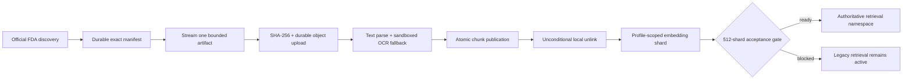

# Authoritative FDA corpus

Last updated: 2026-08-13

This is the source-of-truth contract and runbook for RegWatch's replacement FDA
corpus. It admits exactly five source families:

1. Drugs@FDA
2. SBOA / approval / action packages
3. Product-Specific Guidances (PSGs)
4. FDA bioequivalence guidance
5. Orange Book

The retired public drug API is not a source, dependency, fallback, credential,
or runtime endpoint. DailyMed, NDC, drug-shortage, and REMS acquisition are also
outside this corpus. Compatibility modules fail closed if an old caller reaches
them.

## Current state

The FDA-only schema through migration `0023` is deployed on Fly release 135.
The first `NDA020503` production canary discovered 21 records, indexed 18 of
them into 347 chunks, and exposed three image-only/otherwise unparseable PDFs;
the run is recorded as `failed` with those three errors. All 5,841 chunks
carry active-profile embeddings (5,841 / 5,841, zero pending, verified
directly against the production database on 2026-08-14), so fresh serving
boots pass the profile-readiness guard. The outstanding canary work is the
three unparsed documents, not a vector gap.

This follow-up release adds migration `0024`, document-at-a-time temporary
storage, durable raw artifacts and exact manifests, sandboxed OCR, separate
chunk/embedding lifecycle state, and Dagster orchestration. It must be merged
and deployed before production ingestion resumes. Therefore 140,339 is the
source-record denominator; it is not a chunk count and it is not an embedding
count.

The 2026-08-13 discovery produced:

| Measure | Count |
| --- | ---: |
| Authoritative source records | 140,339 |
| Drugs@FDA | 99,190 |
| SBOA / action packages | 10,156 |
| PSGs | 1,795 |
| FDA BE guidance | 5 |
| Orange Book | 29,193 |
| Rejected out-of-policy or malformed Drugs@FDA links | 711 |

Document-type distribution:

| Document type | Count |
| --- | ---: |
| Application/product metadata | 29,268 |
| Approved label | 31,068 |
| Approval letter | 37,159 |
| Regulatory action | 1,695 |
| Clinical review | 573 |
| Statistical review | 367 |
| Clinical pharmacology review | 486 |
| CMC / quality review | 0 |
| Integrated review | 0 |
| Multidisciplinary review | 18 |
| Other action-package review | 8,712 |
| Product-Specific Guidance | 1,795 |
| FDA BE guidance | 5 |
| Orange Book product | 27,258 |
| Orange Book patent | 1,323 |
| Orange Book exclusivity | 612 |

Zero is an observed category count, not a parser claim that FDA has never
published that review type. Reviews that cannot be classified confidently stay
in `other_review`; the pipeline does not invent a more specific type.

### Reproducibility fingerprints

| Snapshot | SHA-256 |
| --- | --- |
| Complete manifest | `4e5c3708cb309489d9056580a7578b3047560f32aca0345df6ee26c3cd2a7c5e` |
| Drugs@FDA data ZIP | `5ad28811f52a08d951e7d9262871bb17d204d06ea030348d32cdf65dedb2feb9` |
| Drugs@FDA rejected-link ledger | `99c1b7c0b6776e681cdd7f183b0d0d26bef7759f7448a97e6cf7c3cf0347295c` |
| Orange Book ZIP | `a50c72e98297a9957a85986f7a60bf4f549de430d2ea8cce282ee6c1e6195d2c` |
| PSG discovery | `a4f475c88ae4ec57c93d8c29e29b2560d4baa703ce009869ef6f1321e6be6b8f` |
| Reviewed BE guidance manifest | `769bd0eb8be5d2dd3fcefe6c57a45aca7a1cfd60343537bd36589f31be30bbdb` |

Discovery is deterministic for the same official snapshots: artifacts are
sorted by canonical ID, duplicate canonical IDs are rejected, inline snapshot
records are content-hashed, and the complete manifest is fingerprinted.

## Count semantics

RegWatch reports these counters independently:

- `source records`: canonical documents in the discovered manifest;
- `documents`: manifest records with a searchable indexed version;
- `versions`: immutable `(document, content hash, processing fingerprint)` rows;
- `chunks`: citable passages written for current document versions;
- `embedded chunks`: those passages covered by the selected embedding profile;
- `pending chunks`: `chunks - embedded chunks`;
- `coverage`: `embedded chunks / chunks`, never records divided by records.

An operational display should read like this:

```text
Authoritative FDA source records: 140,339
Indexed documents:               <documents> / 140,339
Chunks:                          <chunks>
Embeddings (<profile>):          <embedded_chunks> / <chunks>
Activation ready:                true | false
```

Until the full sync runs, the correct statement is **140,339 discovered source
records; final chunk and embedding totals pending**. Partial canary counters may
be reported separately but must not be presented as full-corpus coverage.

## Source boundary

The allowlist is code, not configuration. `sources/policy.py` owns the exact
families, document types, FDA hosts, family-specific path prefixes, and the five
reviewed BE guidance media paths.

Every network request follows the same rules:

- only `https` on reviewed FDA-owned hosts;
- historical official `http` links may only be upgraded to `https` before use;
- no credentials, nonstandard ports, unsafe path segments, or arbitrary hosts;
- both the initial URL and every redirect target are validated against the same
  source family;
- redirects are followed manually and finitely;
- response bodies, ZIP member counts, uncompressed ZIP size, PDF pages, parse
  time, retries, and worker concurrency are bounded;
- request starts are paced across threads per host;
- unrecognized representations and blank parsed documents fail the document.

The official discovery roots are FDA's
[Drugs@FDA data files](https://www.fda.gov/drugs/drug-approvals-and-databases/drugsfda-data-files),
[Orange Book data files](https://www.fda.gov/drugs/drug-approvals-and-databases/orange-book-data-files),
[PSG catalog](https://www.fda.gov/drugs/guidances-drugs/product-specific-guidances-generic-drug-development),
and [FDA guidance search](https://www.fda.gov/regulatory-information/search-fda-guidance-documents).
The BE guidance list is reviewed and versioned in
[`config/fda_be_guidance_manifest.json`](../config/fda_be_guidance_manifest.json)
instead of accepting every FDA media URL.

## Pipeline and durability



The durability contract is:

- one advisory lock per canonical document;
- the bounded download is SHA-256 hashed while streaming, uploaded to a
  pluggable content-addressed store, and then recorded as an acquired immutable
  version before parsing starts;
- one later database transaction atomically publishes that version's current
  chunks and provenance; a parser failure leaves an auditable failed lifecycle
  row but exposes no partial chunks;
- every staged source, manifest, OCR image, OCR output, and partial download is
  unlinked in a `finally` block on success, failure, timeout, or cancellation;
- raw artifacts and exact gzip manifests are retained by atomic filesystem
  rename locally or SHA-256 metadata-verified S3-compatible upload in production;
- blank PDF pages fall back to Tesseract only inside the killable parser child,
  with page, pixel, CPU, wall-clock, output, file-descriptor, and Linux memory
  limits and no shell invocation;
- unchanged `(content hash, processing fingerprint)` versions are reused;
- `chunk_status` and profile-keyed embedding lifecycle rows checkpoint the two
  phases separately;
- each run records expected, discovered, added, revised, unchanged, failed,
  retired, and chunk counts with a bounded error ledger;
- canonical IDs are deterministically assigned to 512 shards; Dagster runs at
  most four shard processes while each shard processes one document at a time;
- embeddings run as a separate shard backfill with durable checkpoints;
- retirement reconciliation runs only after a successful, unfiltered,
  exact-manifest acceptance; a scoped, limited, or failed run cannot retire data.

Migration `0023_authoritative_fda_corpus` added:

- `fda_document`: stable canonical identity and current source metadata;
- `fda_document_version`: immutable source and processing version facts;
- `fda_corpus_run`: resumable operational ledger;
- chunk provenance: `fda_document_id`, `fda_version_id`, `source_family`,
  `document_type`, and `locator`.

Migration `0024_fda_streaming_lifecycle` adds:

- deterministic `shard_id` ownership;
- artifact URI/retention and acquired/chunked timestamps;
- explicit pending/complete/failed chunk state;
- per-version, per-profile embedding state; and
- the durable exact-manifest pointer and checksum ledger.

Both migrations perform no network calls or backfill. They are bounded by a
lock timeout, preserve the serving corpus, enable RLS on new public tables, and
are reversible.

## Operating runbook

### 1. Release and preflight

Deploy schema and code before resuming the canary:

```bash
uv run alembic upgrade head
uv run alembic current
```

Build `Dockerfile.corpus-worker` and run its default `dagster-daemon` command on
a supervised, restartable machine. Run the same image with
`dagster-webserver -w /app/dagster/workspace.yaml --host 0.0.0.0` only on a
private operator network. Required worker configuration includes:

- the application `DATABASE_URL` and the deployed active Qwen profile settings;
- `QWEN_EMBEDDING_BATCH_SIZE` at or below 24. This setting, not the Dagster
  `batch_size` op config (a database page size), controls how many inputs go
  into one embedding HTTP request, and the endpoint rejects larger input
  arrays with 429 -- the retry loop then resends the same oversized payload
  until the shard fails;
- a separate `DAGSTER_POSTGRES_URL` for run/event/schedule state;
- `FDA_ARTIFACT_STORE=s3`, its bucket/prefix, encryption choice, and preferably
  workload-identity credentials; and
- bounded ephemeral `FDA_CORPUS_TEMP_DIR` with Tesseract available at the
  reviewed `FDA_CORPUS_OCR_BINARY` path.

`docker/dagster.yaml` uses Postgres storage, a queued coordinator, four
concurrent runs, and run-granularity pools. The only schedule freezes a weekly
manifest and is stopped by default. Full chunk and embedding backfills are
always operator-launched.

Reproduce discovery without changing the database and compare its count and
fingerprints before creating a Dagster manifest:

```bash
uv run regwatch authoritative-corpus-plan
```

### 2. Repair and repeat the canary

Launch `authoritative_fda_canary_job` with:

```yaml
ops:
  authoritative_fda_canary:
    config:
      applications: [NDA020503]
      expected_documents: 21
      profile_id: ""
      batch_size: 128
```

The job must report exactly 21 / 21 documents, zero errors, non-zero chunks,
and complete active-profile embeddings. It is safe to rerun: the 18 existing
versions are reused (their 347 chunks are already embedded), and the three
failed documents retry through OCR. Do not start the full manifest until this
gate passes. Check the application-owned counters at any time—even while the serving
profile is incomplete—with:

```bash
uv run regwatch authoritative-corpus-status
```

### 3. Freeze and process the full universe

Launch `authoritative_fda_manifest_job`. Record its logical
`manifest_sha256`, durable artifact URI, compressed artifact SHA-256, source
snapshots, and document count. Every downstream run must use that exact logical
hash; never rediscover separately inside each shard.

In Dagster, launch a 512-partition backfill for `authoritative_fda_shard_job`,
partitions `000` through `511`, with:

```yaml
ops:
  authoritative_fda_chunk_shard:
    config:
      manifest_sha256: <recorded-logical-sha256>
  authoritative_fda_embedding_shard:
    config:
      manifest_sha256: <same-logical-sha256>
      profile_id: ""
      batch_size: 128
```

Each partition of that job chunks shard N and then embeds shard N. Wait for
every partition and both blocking checks, `all_manifest_documents_chunked` and
`all_manifest_chunks_embedded`, to pass. Retry only failed partitions; completed
documents are immutable checkpoints.

The embedding query is scoped to authoritative FDA chunks and that partition's
canonical IDs. It cannot backfill unrelated legacy chunks.

#### Why one interleaved job, and not chunk-all-then-embed-all

Draining `authoritative_fda_chunk_shards_job` across all 512 partitions before
starting `authoritative_fda_embedding_shards_job` is the obvious reading of this
pipeline, and it is **wrong at full-corpus scale**.

A chunk carrying no vector on the active profile is not merely incomplete. It
makes a cold boot fail: `assert_profile_ready_for_activation` refuses a profile
whose `embedded_chunks != total_chunks`, and `init_db` runs that assertion at
every process start. Chunking the whole corpus first therefore parks production
one machine restart away from refusing to boot, and holds it there for the
entire embedding phase -- days, at roughly 1.2M chunks. The 2026-08-13 outage
reached exactly this state with only 347 unembedded chunks.

Interleaving bounds that window to a single shard. The ordering is structural
rather than advisory: `authoritative_fda_embedding_shard` declares
`deps=[authoritative_fda_chunk_shard]` and both assets carry
`FDA_SHARD_PARTITIONS`, so Dagster places the embedding node behind a blocking
dependency on the chunk node's `all_manifest_documents_chunked` check. A shard
whose documents did not all chunk is never embedded.

The two single-asset jobs are retained for repair. Re-embedding one shard after
a provider outage must not re-fetch and re-parse that shard's PDFs.

#### Why the backfill does not freeze production deploys

The boot guard counts the SERVING namespace, not the whole chunk table.
`profile_embedding_coverage` applies the same predicate retrieval uses --
`REGWATCH_RETRIEVAL_CORPUS=legacy` serves rows with NULL `source_family`, the
authoritative corpus serves rows carrying a reviewed family -- to both its
numerator and its denominator. While prod serves `legacy`, an accumulating
authoritative corpus with any number of unembedded chunks cannot fail an app
boot, so deploys and restarts stay safe for the entire backfill.

The guard bites again exactly where it should: the moment
`REGWATCH_RETRIEVAL_CORPUS` flips, the authoritative namespace becomes the
counted universe, and a premature flip over an incomplete corpus fails closed
at the next boot. The flip itself remains gated by the acceptance job's own
full-manifest counts, which are independent of this guard.

Interleaving still matters even with the scoped guard: it keeps the pending
window inside the BUILDING namespace to one shard, so a mid-run repair (a
failed embedding partition, a provider outage) is one shard of work rather
than a corpus-wide reconciliation at acceptance time.

### 4. Acceptance and cutover

Launch `authoritative_fda_acceptance_job` with the same manifest hash and active
profile. Acceptance re-reads all 512 shards from Lakebase, requires exact
document/chunk/vector parity, all five families, zero errors, a complete-universe
manifest, and then performs retirement reconciliation. The job records one
successful full orchestrated run and must pass
`full_manifest_activation_gate`.

Do not set `REGWATCH_RETRIEVAL_CORPUS=authoritative_fda` until status reports:

- all five families have indexed documents;
- zero policy violations;
- zero pending chunks for the selected profile;
- a successful complete-universe run;
- processed documents equal the run's expected and discovered counts;
- searchable documents equal the complete manifest count.

Run the new-namespace evidence-page/span retrieval and end-to-end citation
evaluation before cutover. A passing document hit rate alone is insufficient.

API startup re-evaluates those conditions and refuses the authoritative mode if
any condition is false. Activation is then a reversible configuration change:

```bash
REGWATCH_RETRIEVAL_CORPUS=authoritative_fda
```

Rollback does not delete or rewrite data:

```bash
REGWATCH_RETRIEVAL_CORPUS=legacy
```

After rollback, investigate the recorded run and coverage counters, repair the
underlying document/profile issue, rerun the idempotent phase, and re-evaluate
the gate. Never force the flag past the gate.

## Google engineering alignment

There is no single universal “Google coding standard” that certifies this
system. The relevant public baseline is the
[Google Cloud Well-Architected Framework](https://cloud.google.com/architecture/framework)
plus Google SRE's guidance on
[monitoring distributed systems](https://sre.google/sre-book/monitoring-distributed-systems/).
This implementation maps those principles to concrete controls:

| Area | Implemented control | Release evidence |
| --- | --- | --- |
| Operational excellence | exact manifests, partitioned backfills, explicit lifecycle/run ledgers, blocking checks, documented runbook and rollback | manifest hashes, shard/run IDs, asset checks, status output |
| Security, privacy, compliance | exact FDA source allowlist, manual redirect validation, no retired API key/path, sandboxed OCR, encrypted raw storage, RLS | policy/runtime/OCR tests, image scan, migration review |
| Reliability | immutable acquired versions, atomic chunk publication, independent vector checkpoints, retries, exact-manifest reconciliation, fail-closed activation | cleanup/idempotency/shard/acceptance tests |
| Performance | four run-granularity pools, one-document shard workers, bounded bytes/pages/OCR, per-host pacing, batched vectors | Dagster config test, duration and saturation logs |
| Cost optimization | discovery-only plan, deferred embeddings by default, unchanged-version skip, batch and run limits | zero model calls during plan; pending counters |
| Sustainability | avoid redundant downloads, parses, and embeddings; reuse content-addressed artifacts and immutable versions | content and processing fingerprints |

For SRE-style observability, the corpus exposes or records the useful batch
equivalents of the four golden signals:

- latency: per-document `duration_ms` and run start/completion times;
- traffic: discovered/expected documents, workers, chunks written, embedded
  batches;
- errors: failed document count, typed bounded error samples, failed run state;
- saturation: queued/running shard counts, pool utilization, pending chunks, and
  embedding coverage.

Alerts should be based on user-visible objectives, not raw noise. Recommended
release objectives are: zero policy violations; zero document errors in a
complete run; 100% selected-profile coverage; no missing family; and activation
readiness true. Page on a failed complete run or serving startup rejection;
ticket on a growing pending-embedding backlog or abnormal latency trend.

## Acceptance gate

The corpus is complete only when all of the following are evidenced against the
target environment:

1. migration upgrade and downgrade/re-upgrade rehearsal pass;
2. read-only plan reproduces the reviewed manifest or an explained newer FDA
   snapshot;
3. the application canary reaches exactly 21 / 21 with zero document errors;
4. all 512 chunk partitions and blocking checks pass against one exact manifest;
5. indexed documents equal the full manifest denominator;
6. all 512 embedding partitions reach `embedded_chunks == chunks` on the serving
   profile;
7. authoritative status reports no source-policy violations and
   `activation_ready=true`;
8. retrieval/citation evaluation passes on the new namespace;
9. a serving smoke test passes after cutover;
10. rollback to `legacy` is rehearsed without data loss.

Discovery alone satisfies none of steps 3 through 10. The honest current
handoff is: **140,339 authoritative source records discovered; the first canary
is 18 / 21 with 347 chunks, all embedded on the active profile; deploy this
worker upgrade, repair the canary to 21 / 21, then launch the production
backfills.**
