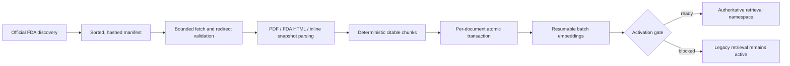

# Authoritative FDA corpus

Last updated: 2026-08-13

This is the source-of-truth contract and runbook for RegWatch's replacement FDA
corpus. It admits exactly five source families:

1. Drugs@FDA
2. SBOA / approval / action packages
3. Product-Specific Guidances (PSGs)
4. FDA bioequivalence guidance
5. Orange Book

The retired public drug API is not a source, dependency, fallback, credential,
or runtime endpoint. DailyMed, NDC, drug-shortage, and REMS acquisition are also
outside this corpus. Compatibility modules fail closed if an old caller reaches
them.

## Current state

The implementation and a full read-only official-source discovery are complete.
The production-scale download, parse, chunk, and embedding backfill have **not**
been run from this worktree. Therefore 140,339 is the source-record denominator;
it is not a chunk count and it is not an embedding count.

The 2026-08-13 discovery produced:

| Measure | Count |
| --- | ---: |
| Authoritative source records | 140,339 |
| Drugs@FDA | 99,190 |
| SBOA / action packages | 10,156 |
| PSGs | 1,795 |
| FDA BE guidance | 5 |
| Orange Book | 29,193 |
| Rejected out-of-policy or malformed Drugs@FDA links | 711 |

Document-type distribution:

| Document type | Count |
| --- | ---: |
| Application/product metadata | 29,268 |
| Approved label | 31,068 |
| Approval letter | 37,159 |
| Regulatory action | 1,695 |
| Clinical review | 573 |
| Statistical review | 367 |
| Clinical pharmacology review | 486 |
| CMC / quality review | 0 |
| Integrated review | 0 |
| Multidisciplinary review | 18 |
| Other action-package review | 8,712 |
| Product-Specific Guidance | 1,795 |
| FDA BE guidance | 5 |
| Orange Book product | 27,258 |
| Orange Book patent | 1,323 |
| Orange Book exclusivity | 612 |

Zero is an observed category count, not a parser claim that FDA has never
published that review type. Reviews that cannot be classified confidently stay
in `other_review`; the pipeline does not invent a more specific type.

### Reproducibility fingerprints

| Snapshot | SHA-256 |
| --- | --- |
| Complete manifest | `4e5c3708cb309489d9056580a7578b3047560f32aca0345df6ee26c3cd2a7c5e` |
| Drugs@FDA data ZIP | `5ad28811f52a08d951e7d9262871bb17d204d06ea030348d32cdf65dedb2feb9` |
| Drugs@FDA rejected-link ledger | `99c1b7c0b6776e681cdd7f183b0d0d26bef7759f7448a97e6cf7c3cf0347295c` |
| Orange Book ZIP | `a50c72e98297a9957a85986f7a60bf4f549de430d2ea8cce282ee6c1e6195d2c` |
| PSG discovery | `a4f475c88ae4ec57c93d8c29e29b2560d4baa703ce009869ef6f1321e6be6b8f` |
| Reviewed BE guidance manifest | `769bd0eb8be5d2dd3fcefe6c57a45aca7a1cfd60343537bd36589f31be30bbdb` |

Discovery is deterministic for the same official snapshots: artifacts are
sorted by canonical ID, duplicate canonical IDs are rejected, inline snapshot
records are content-hashed, and the complete manifest is fingerprinted.

## Count semantics

RegWatch reports these counters independently:

- `source records`: canonical documents in the discovered manifest;
- `documents`: manifest records with a searchable indexed version;
- `versions`: immutable `(document, content hash, processing fingerprint)` rows;
- `chunks`: citable passages written for current document versions;
- `embedded chunks`: those passages covered by the selected embedding profile;
- `pending chunks`: `chunks - embedded chunks`;
- `coverage`: `embedded chunks / chunks`, never records divided by records.

An operational display should read like this:

```text
Authoritative FDA source records: 140,339
Indexed documents:               <documents> / 140,339
Chunks:                          <chunks>
Embeddings (<profile>):          <embedded_chunks> / <chunks>
Activation ready:                true | false
```

Until the full sync runs, the correct statement is **140,339 discovered source
records; chunk and embedding totals pending**. A projected chunk count must not
be presented as measured coverage.

## Source boundary

The allowlist is code, not configuration. `sources/policy.py` owns the exact
families, document types, FDA hosts, family-specific path prefixes, and the five
reviewed BE guidance media paths.

Every network request follows the same rules:

- only `https` on reviewed FDA-owned hosts;
- historical official `http` links may only be upgraded to `https` before use;
- no credentials, nonstandard ports, unsafe path segments, or arbitrary hosts;
- both the initial URL and every redirect target are validated against the same
  source family;
- redirects are followed manually and finitely;
- response bodies, ZIP member counts, uncompressed ZIP size, PDF pages, parse
  time, retries, and worker concurrency are bounded;
- request starts are paced across threads per host;
- unrecognized representations and blank parsed documents fail the document.

The official discovery roots are FDA's
[Drugs@FDA data files](https://www.fda.gov/drugs/drug-approvals-and-databases/drugsfda-data-files),
[Orange Book data files](https://www.fda.gov/drugs/drug-approvals-and-databases/orange-book-data-files),
[PSG catalog](https://www.fda.gov/drugs/guidances-drugs/product-specific-guidances-generic-drug-development),
and [FDA guidance search](https://www.fda.gov/regulatory-information/search-fda-guidance-documents).
The BE guidance list is reviewed and versioned in
[`config/fda_be_guidance_manifest.json`](../config/fda_be_guidance_manifest.json)
instead of accepting every FDA media URL.

## Pipeline and durability



The durability contract is:

- one advisory lock per canonical document;
- one database transaction publishes the document, immutable version, current
  chunks, provenance, and any inline embeddings;
- a failed document transaction exposes neither a partial version nor partial
  chunks;
- artifacts are written by atomic rename into a content-addressed store;
- unchanged `(content hash, processing fingerprint)` versions are reused;
- each run records expected, discovered, added, revised, unchanged, failed,
  retired, and chunk counts with a bounded error ledger;
- a queue of at most four futures per worker prevents a 140k-record manifest
  from becoming 140k in-memory futures;
- embeddings default to a separate batch phase with durable checkpoints;
- retirement reconciliation runs only after a successful, unfiltered,
  complete-universe sync; a scoped, limited, or failed run cannot retire data.

Migration `0023_authoritative_fda_corpus` adds:

- `fda_document`: stable canonical identity and current source metadata;
- `fda_document_version`: immutable source and processing version facts;
- `fda_corpus_run`: resumable operational ledger;
- chunk provenance: `fda_document_id`, `fda_version_id`, `source_family`,
  `document_type`, and `locator`.

The migration performs no network calls or backfill. It is bounded by a lock
timeout, preserves the serving corpus, enables RLS on new public tables, and is
reversible.

## Operating runbook

Run schema deployment first:

```bash
uv run alembic upgrade head
```

Reproduce discovery without changing the database:

```bash
uv run regwatch authoritative-corpus-plan
```

Exercise one application before the full run:

```bash
uv run regwatch authoritative-corpus-plan --application NDA020503
uv run regwatch authoritative-corpus-sync \
  --application NDA020503 --limit 25 --defer-embeddings --workers 4
uv run regwatch authoritative-corpus-status
```

Build the complete chunk corpus. The default defers model traffic:

```bash
uv run regwatch authoritative-corpus-sync --defer-embeddings --workers 4
```

Backfill the active immutable embedding profile in durable batches:

```bash
uv run regwatch authoritative-corpus-embed \
  --profile-id "$ACTIVE_EMBEDDING_PROFILE" --batch-size 128
uv run regwatch authoritative-corpus-status
```

The embed command selects only authoritative FDA chunks. It never backfills an
unrelated legacy chunk by accident. Re-running sync or embedding is expected and
resumes from committed state.

Do not set `REGWATCH_RETRIEVAL_CORPUS=authoritative_fda` until status reports:

- all five families have indexed documents;
- zero policy violations;
- zero pending chunks for the selected profile;
- a successful complete-universe run;
- processed documents equal the run's expected and discovered counts;
- searchable documents equal the complete manifest count.

API startup re-evaluates those conditions and refuses the authoritative mode if
any condition is false. Activation is then a reversible configuration change:

```bash
REGWATCH_RETRIEVAL_CORPUS=authoritative_fda
```

Rollback does not delete or rewrite data:

```bash
REGWATCH_RETRIEVAL_CORPUS=legacy
```

After rollback, investigate the recorded run and coverage counters, repair the
underlying document/profile issue, rerun the idempotent phase, and re-evaluate
the gate. Never force the flag past the gate.

## Google engineering alignment

There is no single universal “Google coding standard” that certifies this
system. The relevant public baseline is the
[Google Cloud Well-Architected Framework](https://cloud.google.com/architecture/framework)
plus Google SRE's guidance on
[monitoring distributed systems](https://sre.google/sre-book/monitoring-distributed-systems/).
This implementation maps those principles to concrete controls:

| Area | Implemented control | Release evidence |
| --- | --- | --- |
| Operational excellence | deterministic plan, explicit run ledger, structured per-document completion/error logs, documented runbook and rollback | manifest hash, run ID, status output, logs |
| Security, privacy, compliance | exact FDA source allowlist, manual redirect validation, no retired API key/path, parser and download limits, RLS | policy/runtime tests, migration review |
| Reliability | idempotent immutable versions, content hashes, advisory locks, per-document atomicity, full-run-only reconciliation, fail-closed activation | rollback/idempotency/reconciliation tests |
| Performance | bounded worker pool, bounded in-flight queue, per-host pacing, snapshot cache, batched embedding writes | concurrency test, duration logs |
| Cost optimization | discovery-only plan, deferred embeddings by default, unchanged-version skip, batch and run limits | zero model calls during plan; pending counters |
| Sustainability | avoid redundant downloads, parses, and embeddings; reuse content-addressed artifacts and immutable versions | content and processing fingerprints |

For SRE-style observability, the corpus exposes or records the useful batch
equivalents of the four golden signals:

- latency: per-document `duration_ms` and run start/completion times;
- traffic: discovered/expected documents, workers, chunks written, embedded
  batches;
- errors: failed document count, typed bounded error samples, failed run state;
- saturation: bounded workers/in-flight queue, pending chunks, and embedding
  coverage.

Alerts should be based on user-visible objectives, not raw noise. Recommended
release objectives are: zero policy violations; zero document errors in a
complete run; 100% selected-profile coverage; no missing family; and activation
readiness true. Page on a failed complete run or serving startup rejection;
ticket on a growing pending-embedding backlog or abnormal latency trend.

## Acceptance gate

The corpus is complete only when all of the following are evidenced against the
target environment:

1. migration upgrade and downgrade/re-upgrade rehearsal pass;
2. read-only plan reproduces the reviewed manifest or an explained newer FDA
   snapshot;
3. full deferred sync succeeds with zero document errors;
4. indexed documents equal the full manifest denominator;
5. embedding backfill reaches `embedded_chunks == chunks` on the serving
   profile;
6. authoritative status reports no source-policy violations and
   `activation_ready=true`;
7. retrieval/citation evaluation passes on the new namespace;
8. a serving smoke test passes after cutover;
9. rollback to `legacy` is rehearsed without data loss.

Discovery alone satisfies none of steps 3 through 9. The honest current
handoff is: **implementation ready; 140,339 authoritative source records
discovered; production-scale chunks and embeddings not yet built.**
