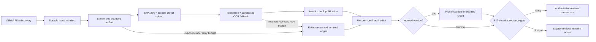

# Authoritative FDA corpus

Last updated: 2026-08-26

This is the source-of-truth contract and runbook for RegWatch's replacement FDA
corpus. It admits exactly five source families:

1. Drugs@FDA
2. SBOA / approval / action packages
3. Product-Specific Guidances (PSGs)
4. FDA bioequivalence guidance
5. Orange Book

The retired public drug API is not a source, dependency, fallback, credential,
or runtime endpoint. DailyMed, NDC, drug-shortage, and REMS acquisition are also
outside this corpus. Compatibility modules fail closed if an old caller reaches
them.

## Current state

The document-at-a-time worker, durable raw artifacts and manifests, sandboxed
OCR, separate chunk/embedding lifecycle, and Dagster orchestration are
deployed. The corrected `NDA020503` canary passed 21 / 21 and produced 499
chunks. Retrieval remains on `legacy`; neither an accumulating authoritative
namespace nor this release authorizes cutover.

A supervised operator session ran the full production backfill against the
frozen complete-universe manifest below. That target turned out to be
unreachable; see "Scoped activation, 2026-08-18" for what changed and what
the path to cutover looks like now. For the corpus's live state, run
`regwatch authoritative-corpus-status`. It reads the database directly and
reports resolved, indexed, and terminal counts, per-family coverage, and
whether activation is ready. This document does not restate a point-in-time
run of that command; the numbers are stale the moment they are copied here.

Migration `0025_fda_terminal_resolution` adds the missing acceptance ledger for
the inevitable tail. A manifest record is not silently skipped: it must resolve
to an indexed current version or, after the durable retry budget is exhausted,
to one of two narrowly validated terminal outcomes. An exact HTTP 404 may become
`missing_at_source`; a reviewed PDF parser error may become `unparseable` only
when the exact source bytes remain in durable artifact storage. Other download,
storage, database, chunk-publication, and embedding failures remain unresolved
errors and continue to block acceptance.

The frozen production manifest contains:

| Measure | Count |
| --- | ---: |
| Authoritative source records | 140,438 |
| Drugs@FDA | 99,198 |
| SBOA / action packages | 10,156 |
| PSGs | 1,795 |
| FDA BE guidance | 5 |
| Orange Book | 29,284 |

Document-type distribution:

| Document type | Count |
| --- | ---: |
| Application/product metadata | 29,270 |
| Approved label | 31,069 |
| Approval letter | 37,164 |
| Regulatory action | 1,695 |
| Clinical review | 573 |
| Statistical review | 367 |
| Clinical pharmacology review | 486 |
| CMC / quality review | 0 |
| Integrated review | 0 |
| Multidisciplinary review | 18 |
| Other action-package review | 8,712 |
| Product-Specific Guidance | 1,795 |
| FDA BE guidance | 5 |
| Orange Book product | 27,333 |
| Orange Book patent | 1,332 |
| Orange Book exclusivity | 619 |

Zero is an observed category count, not a parser claim that FDA has never
published that review type. Reviews that cannot be classified confidently stay
in `other_review`; the pipeline does not invent a more specific type.

### Reproducibility fingerprints

| Snapshot | SHA-256 |
| --- | --- |
| Frozen complete manifest | `fae78c8eb6c5b601a5a52539ec7b62444d1eb7c745879d04ce1d031fa75c0c84` |

The component snapshot fingerprints remain in that durable manifest's
`source_snapshots_json`; operators must use the recorded row instead of copying
fingerprints from the superseded 2026-08-13 discovery.

Discovery is deterministic for the same official snapshots: artifacts are
sorted by canonical ID, duplicate canonical IDs are rejected, inline snapshot
records are content-hashed, and the complete manifest is fingerprinted.

## Scoped activation, 2026-08-18

The complete-universe target above is no longer the only path to cutover.
`config/settings.py:508-516` records that the full 140,438 source record
universe became permanently unreachable under the Lakebase free tier's 512
MiB cap.

`REGWATCH_SERVING_MANIFEST_SHA` names the alternative. Set, activation counts
against that exact manifest sha256 instead of requiring a complete-universe
run: `src/regwatch/corpus/status.py` looks for a successful sync of the named
manifest in place of the frozen complete-universe one, and every downstream
acceptance check (family coverage, embedding parity, error count) evaluates
against that manifest's scope instead. Unset, the variable keeps the original
complete-universe-only behavior, which after 2026-08-18 means the corpus can
never activate.

No curated manifest is configured today; `REGWATCH_SERVING_MANIFEST_SHA` is
unset in `.env.example` and unset in `fly.toml`. Deciding what a curated
manifest should contain, then building and accepting one, is open work. See
[`ROADMAP.md`](ROADMAP.md), "Corpus: review the curated inventory and decide
the serving flip".

## Count semantics

RegWatch reports these counters independently:

- `source records`: canonical documents in the discovered manifest;
- `documents`: manifest records with a searchable indexed version;
- `versions`: immutable `(document, content hash, processing fingerprint)` rows;
- `terminal documents`: current manifest-bound `missing_at_source` or
  `unparseable` versions whose evidence passes acceptance validation;
- `resolved records`: `documents + terminal documents`, which must equal the
  frozen source-record denominator;
- `chunks`: citable passages written for current document versions;
- `embedded chunks`: those passages covered by the selected embedding profile;
- `pending chunks`: `chunks - embedded chunks`;
- `coverage`: `embedded chunks / chunks`, never records divided by records.

An operational display should read like this:

```text
Authoritative FDA source records: 140,438
Resolved records:                <documents + terminal> / 140,438
Indexed documents:               <documents>
Terminal outcomes:               <terminal>
Chunks:                          <chunks>
Embeddings (<profile>):          <embedded_chunks> / <chunks>
Activation ready:                true | false
```

Until full acceptance passes, the correct statement is:
**140,438 frozen source records; final resolved, chunk, and embedding totals
are pending.** Moving backfill counters and the completed canary may be
reported separately but must not be presented as full-corpus coverage.

## Source boundary

The allowlist is code, not configuration. `sources/policy.py` owns the exact
families, document types, FDA hosts, family-specific path prefixes, and the five
reviewed BE guidance media paths.

Every network request follows the same rules:

- only `https` on reviewed FDA-owned hosts;
- historical official `http` links may only be upgraded to `https` before use;
- no credentials, nonstandard ports, unsafe path segments, or arbitrary hosts;
- both the initial URL and every redirect target are validated against the same
  source family;
- redirects are followed manually and finitely;
- response bodies, ZIP member counts, uncompressed ZIP size, PDF pages, parse
  time, retries, and worker concurrency are bounded;
- request starts are paced across threads per host;
- unrecognized representations and blank parsed documents fail the document.

The official discovery roots are FDA's
[Drugs@FDA data files](https://www.fda.gov/drugs/drug-approvals-and-databases/drugsfda-data-files),
[Orange Book data files](https://www.fda.gov/drugs/drug-approvals-and-databases/orange-book-data-files),
[PSG catalog](https://www.fda.gov/drugs/guidances-drugs/product-specific-guidances-generic-drug-development),
and [FDA guidance search](https://www.fda.gov/regulatory-information/search-fda-guidance-documents).
The BE guidance list is reviewed and versioned in
[`config/fda_be_guidance_manifest.json`](../config/fda_be_guidance_manifest.json)
instead of accepting every FDA media URL.

## Pipeline and durability



The durability contract is:

- one advisory lock per canonical document;
- the bounded download is SHA-256 hashed while streaming, uploaded to a
  pluggable content-addressed store, and then recorded as an acquired immutable
  version before parsing starts;
- one later database transaction atomically publishes that version's current
  chunks and provenance; a parser failure leaves an auditable failed lifecycle
  row but exposes no partial chunks;
- every staged source, manifest, OCR image, OCR output, and partial download is
  unlinked in a `finally` block on success, failure, timeout, or cancellation;
- raw artifacts and exact gzip manifests are retained by atomic filesystem
  rename locally or SHA-256 metadata-verified S3-compatible upload in production;
- blank PDF pages fall back to Tesseract only inside the killable parser child,
  with page, pixel, CPU, wall-clock, output, file-descriptor, and Linux memory
  limits and no shell invocation;
- unchanged `(content hash, processing fingerprint)` versions are reused;
- one partial unique index selects exactly one current lifecycle version for a
  document, and terminal publication atomically removes any older searchable
  chunks for that document;
- parser and exact-404 attempts are durably counted. The default terminal
  threshold is four attempts: the initial shard attempt plus its three Dagster
  retries. Attempt budgets reset when the exact manifest SHA-256 changes, so
  observations from an older freeze cannot exhaust a newer run's budget;
- every terminal row is bound to the exact manifest SHA-256, canonical ID,
  source URL, attempt count, error, and resolution time. Missing-source rows
  require an exact 404 observation; unparseable rows require retained source
  bytes and a reviewed parser error type;
- `chunk_status` and profile-keyed embedding lifecycle rows checkpoint the two
  phases separately;
- each run records expected, discovered, added, revised, unchanged, failed,
  retired, and chunk counts with a bounded error ledger;
- canonical IDs are deterministically assigned to 512 shards; Dagster runs at
  most four shard processes while each shard processes one document at a time;
- embeddings run as a separate shard backfill with durable checkpoints;
- retirement reconciliation runs only after a successful, unfiltered,
  exact-manifest acceptance; a scoped, limited, or failed run cannot retire data.

Migration `0023_authoritative_fda_corpus` added:

- `fda_document`: stable canonical identity and current source metadata;
- `fda_document_version`: immutable source and processing version facts;
- `fda_corpus_run`: resumable operational ledger;
- chunk provenance: `fda_document_id`, `fda_version_id`, `source_family`,
  `document_type`, and `locator`.

Migration `0024_fda_streaming_lifecycle` adds:

- deterministic `shard_id` ownership;
- artifact URI/retention and acquired/chunked timestamps;
- explicit pending/complete/failed chunk state;
- per-version, per-profile embedding state; and
- the durable exact-manifest pointer and checksum ledger.

Migration `0025_fda_terminal_resolution` adds:

- one explicitly current version per FDA document;
- `pending`, `indexed`, `missing_at_source`, and `unparseable` resolution state;
- durable attempt, error, timestamp, hash-kind, and JSON evidence fields; and
- terminal-document counts on the corpus run ledger.

The migration marks only already searchable versions as `indexed` and chooses
their current lifecycle row. It does not infer terminal outcomes from historical
failures. All three migrations perform no network calls or corpus backfill. They
are bounded by a lock timeout, preserve the serving corpus, enable RLS on new
public tables, and are reversible.

## Operating runbook

### 1. Release and preflight

Deploy schema and code before terminal-tail repair or acceptance:

```bash
uv run alembic upgrade head
uv run alembic current
```

Build `Dockerfile.corpus-worker` and run its default `dagster-daemon` command on
a supervised, restartable machine. Run the same image with
`dagster-webserver -w /app/dagster/workspace.yaml --host 0.0.0.0` only on a
private operator network. Required worker configuration includes:

- the application `DATABASE_URL` and the embedding settings the deployed
  serving profile was built with. See
  [`CONFIG_REFERENCE.md`](CONFIG_REFERENCE.md) for the current names
  (`INGEST_EMBEDDING_PROVIDER`, `RETRIEVAL_EMBEDDING_PROFILE`, and the
  `OPENAI_EMBEDDING_*` group);
- a per-request input batch size the serving endpoint accepts. This is the
  provider batch size, not the Dagster `batch_size` op config, which is a
  database page size. Get it wrong and the endpoint answers 429, and the retry
  loop resends the same oversized payload until the shard fails. The retired
  Databricks endpoint capped it near 24 inputs; the OpenAI endpoint takes up to
  2048 (`src/regwatch/process/embedder.py`), so the binding limit today is the
  account request and token rate, not the batch;
- a separate `DAGSTER_POSTGRES_URL` for run/event/schedule state;
- `FDA_ARTIFACT_STORE=s3`, its bucket/prefix, encryption choice, and preferably
  workload-identity credentials; and
- bounded ephemeral `FDA_CORPUS_TEMP_DIR` with Tesseract available at the
  reviewed `FDA_CORPUS_OCR_BINARY` path.

`docker/dagster.yaml` uses Postgres storage, a queued coordinator, four
concurrent runs, and run-granularity pools. The only schedule freezes a weekly
manifest and is stopped by default. Full chunk and embedding backfills are
always operator-launched.

Reproduce discovery without changing the database and compare its count and
fingerprints before creating a Dagster manifest:

```bash
uv run regwatch authoritative-corpus-plan
```

### 2. Preserve the completed canary gate

The already-passed canary used this contract:

```yaml
ops:
  authoritative_fda_canary:
    config:
      applications: [NDA020503]
      expected_documents: 21
      profile_id: ""
      batch_size: 128
```

The production canary has already reported exactly 21 / 21 documents, zero
errors, 499 chunks, and complete active-profile embeddings. This remains a
strict indexed-document gate: a terminal outcome never counts toward 21 / 21.
Do not rerun it or any other production Dagster job from a second operator
session while the full backfill is owned elsewhere. Check the application-owned
counters from the owning session, even while the building profile is
incomplete, with:

```bash
uv run regwatch authoritative-corpus-status
```

### 3. Freeze and process the full universe

The production manifest is already frozen. **Do not launch
`authoritative_fda_manifest_job` again while its backfill is running.** The
driver resolves the newest complete-universe row, so a second freeze could swap
the manifest beneath an in-flight sweep. The owned run's exact contract is:

```text
manifest_sha256: fae78c8eb6c5b601a5a52539ec7b62444d1eb7c745879d04ce1d031fa75c0c84
document_count:  140438
```

For a future clean run, launch the manifest job once and record its logical
SHA-256, durable artifact URI, compressed artifact SHA-256, source snapshots,
and document count. Every downstream run must use that exact logical hash;
never rediscover separately inside each shard.

In Dagster, launch a 512-partition backfill for `authoritative_fda_shard_job`,
partitions `000` through `511`, with:

```yaml
ops:
  authoritative_fda_chunk_shard:
    config:
      manifest_sha256: <recorded-logical-sha256>
  authoritative_fda_embedding_shard:
    config:
      manifest_sha256: <same-logical-sha256>
      profile_id: ""
      batch_size: 128
```

Each partition of that job chunks shard N and then embeds shard N. Wait for
every partition and both blocking checks, `all_manifest_documents_chunked` and
`all_manifest_chunks_embedded`, to pass. Retry only failed partitions; completed
documents are immutable checkpoints.

The embedding query is scoped to authoritative FDA chunks and that partition's
canonical IDs. It cannot backfill unrelated legacy chunks.

#### Why one interleaved job, and not chunk-all-then-embed-all

Draining `authoritative_fda_chunk_shards_job` across all 512 partitions before
starting `authoritative_fda_embedding_shards_job` is the obvious reading of this
pipeline, and it is **wrong at full-corpus scale**.

A chunk carrying no vector on the active profile is not merely incomplete. It
makes a cold boot fail: `assert_profile_ready_for_activation` refuses a profile
whose `embedded_chunks != total_chunks`, and `init_db` runs that assertion at
every process start. Chunking the whole corpus first therefore parks production
one machine restart away from refusing to boot, and holds it there for the
entire embedding phase -- days, at roughly 1.2M chunks. The 2026-08-13 outage
reached exactly this state with only 347 unembedded chunks.

Interleaving bounds that window to a single shard. The ordering is structural
rather than advisory: `authoritative_fda_embedding_shard` declares
`deps=[authoritative_fda_chunk_shard]` and both assets carry
`FDA_SHARD_PARTITIONS`, so Dagster places the embedding node behind a blocking
dependency on the chunk node's `all_manifest_documents_chunked` check. A shard
whose documents did not all chunk is never embedded.

The two single-asset jobs are retained for repair. Re-embedding one shard after
a provider outage must not re-fetch and re-parse that shard's PDFs.

#### Why the backfill does not freeze production deploys

The boot guard counts the SERVING namespace, not the whole chunk table.
`profile_embedding_coverage` applies the same predicate retrieval uses --
`REGWATCH_RETRIEVAL_CORPUS=legacy` serves rows with NULL `source_family`, the
authoritative corpus serves rows carrying a reviewed family -- to both its
numerator and its denominator. While prod serves `legacy`, an accumulating
authoritative corpus with any number of unembedded chunks cannot fail an app
boot, so deploys and restarts stay safe for the entire backfill.

The guard bites again exactly where it should: the moment
`REGWATCH_RETRIEVAL_CORPUS` flips, the authoritative namespace becomes the
counted universe, and a premature flip over an incomplete corpus fails closed
at the next boot. The flip itself remains gated by the acceptance job's own
full-manifest counts, which are independent of this guard.

Interleaving still matters even with the scoped guard: it keeps the pending
window inside the BUILDING namespace to one shard, so a mid-run repair (a
failed embedding partition, a provider outage) is one shard of work rather
than a corpus-wide reconciliation at acceptance time.

### 4. Acceptance and cutover

After the owning backfill session finishes and migration 0025 is deployed,
launch `authoritative_fda_acceptance_job` with the same manifest hash and
active profile. The manifest hash can name either the frozen complete-universe
manifest or a curated one set as `REGWATCH_SERVING_MANIFEST_SHA`; see "Scoped
activation, 2026-08-18" above. Acceptance re-reads the shards in scope from
Lakebase. For every manifest
record it requires exactly one current version that is either indexed or has a
valid terminal ledger entry. It revalidates terminal evidence against the exact
manifest, requires vector parity for every indexed chunk, all five families,
zero unresolved errors, and a complete-universe manifest, then performs
retirement reconciliation. The job records indexed and terminal counts
separately in one successful full orchestrated run and must pass
`full_manifest_activation_gate`.

Do not set `REGWATCH_RETRIEVAL_CORPUS=authoritative_fda` until status reports:

- all five families have indexed documents;
- zero policy violations;
- zero pending chunks for the selected profile;
- a successful complete-universe run;
- indexed plus terminal documents equal the run's expected and discovered
  counts;
- current terminal counts match the accepted run; and
- searchable documents equal `complete manifest count - terminal documents`.

Run the new-namespace evidence-page/span retrieval and end-to-end citation
evaluation before cutover. A passing document hit rate alone is insufficient.

API startup re-evaluates those conditions and refuses the authoritative mode if
any condition is false. Activation is then a reversible configuration change:

```bash
REGWATCH_RETRIEVAL_CORPUS=authoritative_fda
```

Rollback does not delete or rewrite data:

```bash
REGWATCH_RETRIEVAL_CORPUS=legacy
```

After rollback, investigate the recorded run and coverage counters, repair the
underlying document/profile issue, rerun the idempotent phase, and re-evaluate
the gate. Never force the flag past the gate.

## Observability

The corpus records four kinds of operational signal: latency (per-document
`duration_ms`, run start/completion times), traffic (discovered/expected
documents, workers, chunks written, embedded batches), errors (unresolved
document count, typed bounded error samples, failed run state), and
saturation (queued/running shard counts, pool utilization, pending chunks).

Recommended release objectives: zero policy violations, zero unresolved
document errors in a complete run, indexed plus evidence-backed terminal
parity with the exact manifest, full selected-profile coverage for indexed
chunks, no missing family, and activation readiness true. Page on a failed
complete run or a serving startup rejection. Ticket on a new terminal
outcome, a growing pending-embedding backlog, or an abnormal latency trend.

## Acceptance gate

Two acceptance paths exist. Both share steps 1-3 and 7-10 below; they differ
only in what steps 4-6 measure against.

**Complete-universe path: unreachable.** Steps 4-6 measure against the full
140,438-record manifest, all 512 shards. This can never finish under the
Lakebase free tier's 512 MiB cap; see "Scoped activation, 2026-08-18" above.
Do not pursue this path.

**Scoped, curated-manifest path: the realistic one.** With
`REGWATCH_SERVING_MANIFEST_SHA` set, steps 4-6 measure against that named
manifest's shards instead of the full universe. No manifest is named today;
building and naming one is open work, tracked in
[`ROADMAP.md`](ROADMAP.md).

1. migration upgrade and downgrade/re-upgrade rehearsal pass;
2. read-only plan reproduces the reviewed manifest or an explained newer FDA
   snapshot;
3. the application canary reaches exactly 21 / 21 with zero document errors;
4. every chunk partition in scope, and its blocking checks, pass against one
   exact manifest;
5. indexed plus evidence-backed terminal documents equal the in-scope
   manifest's denominator, with every terminal row revalidated against the
   exact manifest;
6. every embedding partition in scope reaches `embedded_chunks == chunks` on
   the serving profile;
7. authoritative status reports no source-policy violations and
   `activation_ready=true`;
8. retrieval/citation evaluation passes on the new namespace;
9. a serving smoke test passes after cutover;
10. rollback to `legacy` is rehearsed without data loss.

Discovery alone satisfies none of steps 3 through 10. The honest current
handoff is: 140,438 frozen source records are recorded under manifest
`fae78c8e...75c0c84`; the corrected canary passed 21 / 21 with 499 chunks;
the complete-universe path above is closed; no curated manifest is named yet
via `REGWATCH_SERVING_MANIFEST_SHA`; the corpus remains on the legacy serving
namespace.
