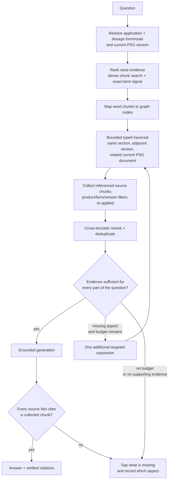

# Graph-Assisted Adaptive Retrieval

> **Status: proposed design. Only the Tier-1 storage is built.**
> Last updated: 2026-08-18.
>
> Migration `0018_knowledge_graph` and `src/regwatch/store/graph_store.py` write
> deterministic application, PSG-document and PSG-section nodes, typed edges, and
> node-to-chunk references. Verified today: `derive_document_graph` is called
> only from the `regwatch graph-backfill` CLI command. Ingest-time population
> was retired on 2026-08-18 because nothing reads those tables. There is no read
> API and no traversal code. Ask still uses the plain vector retrieval path in
> `ARCHITECTURE.md`. Revival path: run the CLI backfill when a traversal
> consumer ships, and only then re-wire ingest-time derivation.

## Why bother

Recall suffers when the evidence for one question is split across chunks,
sections, or separate current PSG documents. The graph is meant to fix that
specific failure without weakening grounding.

The rule the system runs on today, and that this design must not bend: a
sentence that states what FDA guidance says has to carry the passage numbers it
came from, and `generate/turn_gate.py` drops it if it does not. Our own reading
and ordinary conversation carry no numbers and assert no FDA facts.

The graph is a navigation index. It can find and connect candidate evidence. It
is never evidence itself. Only source chunks are citable.

This targets **false refusals caused by fragmented evidence**. It does not turn
a correct "I could not find that" into an answer just because more nearby text
exists.

## Where things stand

The Ask path today:

1. Resolves one product and, where needed, one dosage-form/route pair.
2. Restricts retrieval to the current PSG version, so superseded chunks cannot
   be cited (`retrieve/retriever.py` `_current_version_ids_for_filters`).
3. Embeds the question through the active embedding profile (1024-dim; see
   `docs/PRODUCTION_TRUTH.md` for which provider is live) and runs a
   product-filtered pgvector cosine search.
4. Takes up to `VECTOR_TOP_K` candidates, optionally reranks them (the reranker
   is off by default), and sends at most `RERANK_TOP_K` passages to synthesis.
5. Withholds passages below `REFUSAL_SCORE_THRESHOLD` before synthesis runs.
6. Validates every emitted citation against the retrieved passages.

The Tier-1 graph that exists:

| Object | Values written | Purpose |
|---|---|---|
| Node | `application`, `psg_doc`, `psg_section` | The deterministic PSG hierarchy |
| Edge | `HAS_PSG`, `HAS_SECTION`, `FOLLOWS` | Product to document, document to section, and section order |
| Chunk reference | `primary`, `member` | Navigate from a node to the citable chunks under it |

Nodes and edges are derived by string joins over rows that already exist, in the
same transaction as the chunk write. The derivation is idempotent: section nodes
are version-scoped and rebuilt from scratch on every call, so an FDA revision
does not accumulate generations. The `graph_node_chunk` check constraint also
allows a `mention` reference type, but Tier 1 never writes one.

Tier 1 deliberately has no node embeddings, no cross-source hubs, no LLM-mined
relationships, and no runtime traversal. A query embedding cannot search graph
nodes today.

## Target query flow

The operating rule is **retrieve enough evidence within a fixed budget**, not
"retrieve as much context as possible". Unbounded traversal buys irrelevant
boilerplate, latency, tokens, and a better chance of blending requirements that
should stay apart.

## The algorithm

### 1. Resolve the hard scope first

Product resolution stays outside semantic retrieval. The query has to be pinned
to one application, one normalized product, one dosage-form/route pair when the
product has several forms, and the current PSG version or versions the existing
rule selects.

Every graph query and every returned chunk re-applies that scope. Traversal may
never cross to a different product, form, or superseded version.

### 2. Pick seed evidence

The first runtime version should reuse the existing chunk embeddings rather than
add node embeddings:

1. Run the current product-filtered dense search.
2. Add an exact-term signal for application numbers, strengths, analytes,
   acronyms, named study types, and FDA terminology.
3. Keep a small set of high-recall seed chunks.
4. Map those chunks through `graph_node_chunk` to their section and document
   nodes.

Dense and exact-term retrieval fail differently, which is the point of having
both. Traversal cannot recover from a missed entry point if neither seed method
lands in the right neighborhood.

Node embeddings are a later option. They only help once nodes carry meaningful
descriptions. Embedding a heading like "Recommendations" is weaker than
embedding the text under it.

### 3. Traverse typed edges on a budget

Traversal is allowlisted by edge type and query intent. First implementation:

- all `member` chunks in a matched section;
- one `FOLLOWS` hop back and forward, for evidence that straddles a boundary;
- sibling sections or other current PSG documents only when the question needs
  several evidence components.

Starting limits:

| Limit | Initial value | Reason |
|---|---:|---|
| Traversal depth | 2 hops | Prevent fan-out |
| Expansion rounds | 2 total | Bound latency and retry-like behavior |
| Candidate chunks | 30 | Keep reranking tractable |
| Final passages | 8-12 | Bound synthesis context |
| Context budget | Explicit token cap | No unbounded "more context" |

These are starting values, not production truths. The evaluation harness picks
the final ones.

### 4. Collect and score source chunks

Every traversed node resolves back to chunk IDs through `graph_node_chunk`.
Candidates deduplicate by chunk ID and keep:

- seed rank and seed method;
- graph path and hop count;
- edge type and edge confidence;
- node-to-chunk reference type;
- dense, exact-term, fusion and reranker scores;
- product, form, document, version, section and page metadata.

The graph path is audit metadata, not a citation. The citation still names the
source document and page carried by the chunk.

### 5. Rerank after expansion

Graph proximity is not relevance. A cross-encoder or equivalent query-passage
reranker scores the whole expanded candidate set and picks the final passages.
Path features may break ties or apply a hop penalty, but must not override direct
passage relevance.

The reranker has to be a provider boundary, not an in-process model load in the
API. It gets the same data-residency, timeout, observability and fallback rules
as the embedding and generation providers.

### 6. Decide whether the evidence is enough

Sufficiency works on evidence requirements, not one universal cosine cutoff.

For a single-part question: is there at least one current, scoped, high-relevance
passage that directly supports an answer? For a multi-part question, track each
requested aspect on its own: study design, fasting or fed condition, analyte,
strength, endpoint or acceptance criterion, and whether the guidance explicitly
does not specify the requested fact.

| Outcome | Action |
|---|---|
| Every requested aspect supported | Generate from the supported passages |
| A named aspect is missing and one expansion remains | Traverse only that aspect's neighborhood |
| Evidence is still incomplete | Say what could not be found and record which aspect lacked support |
| Current sources conflict | Say so or clarify, per a documented conflict policy |

Log the sufficiency result with the candidate set and the traversal trace. It
does not bypass post-generation citation validation.

## Invariants the graph must preserve

1. **Chunks are the only citable unit.** Nodes, edges, generated descriptions and
   graph paths cannot be cited as FDA evidence.
2. **Scope before traversal.** Application, product, form, route and
   current-version constraints apply before seed retrieval and again when
   collecting chunks.
3. **Bounded traversal.** Depth, fan-out, rounds, candidate count and context
   tokens all have hard limits.
4. **Provenance on every edge and reference.** Tier-1 edges keep their derivation
   metadata. Future Tier-2 edges need source-chunk provenance and a confidence
   value.
5. **No graph-only answer path.** Generation sees verified source chunks, never
   graph summaries alone.
6. **Post-generation validation stays authoritative.** Every source-fact sentence
   still has to map to a collected passage, or the gate drops it (INV-1).
7. **One audit record per query.** Seed methods, traversal paths, expansion
   reason, sufficiency outcome, final chunks, decline reason and latency all
   attach to the existing query audit row.
8. **Safe degradation.** If the graph consumer fails, the request may fall back to
   the plain scoped retrieval result only if that result passes the normal gates
   on its own.

## Rollout plan

**G0, deterministic graph foundation. Landed.** Migration `0018_knowledge_graph`,
Tier-1 nodes/edges/refs derived in the same transaction as the chunk write,
chunks still the only citable unit, no runtime behavior change.

**G1, read-only traversal consumer.** Add a graph-store read API. Map dense seed
chunks to section nodes. Expand same-section members plus one adjacent section
either way. Re-apply product, form and current-version filters after expansion.
Record the traversal trace. Ship behind a default-off flag.

**G2, ranking and context controls.** Add the exact-term candidate signal and
rank fusion. Add a production-safe reranker provider. Deduplicate and enforce the
candidate, passage, hop and token budgets. Compare graph-assisted and baseline
ranks item by item.

**G3, adaptive sufficiency.** Represent single- and multi-part evidence
requirements. Allow at most one targeted second expansion. Produce specific
reasons like `missing_evidence:fasting_condition`. The citation validator stays
the final authority.

**G4, richer deterministic graph.** Only after G1 to G3 show measurable value.
Add source-backed nodes and typed edges for concepts already present in
structured RegWatch data: study designs, analytes, conditions, requirements,
Orange Book records, SPL sections. Every relation points back to the source
chunks or rows that justify it.

**G5, optional node embeddings.** Only if evaluation shows chunk-seeded traversal
misses useful entry points. A node-embedding switch needs the same immutable
profile, backfill, index-readiness, shadow and promotion gates as chunk
embeddings.

## Evaluation and promotion gates

The Q&A gold set is 62 rows today (`src/regwatch/eval/gold_set.jsonl`,
re-verified 2026-08-26; the file has comment lines mixed in, so count with
`grep -vc '^\s*#\|^\s*$'`, not `wc -l`). It is stratified by category: refusal
16, current_version 14, exact_identifier 11, exception 7,
duplicate_boilerplate 6, table 5, clarification 3. None of those strata
separate single-section from cross-section evidence, which is exactly what
this change is supposed to improve, so expand the set before tuning traversal
or sufficiency. Re-run the count before relying on it; it will drift.

Compare baseline and graph-assisted on, at minimum:

- candidate recall at 10, 30 and 50;
- mean reciprocal rank and nDCG;
- false-decline rate on answerable questions;
- correct-decline rate on absent or unsupported questions;
- citation precision and fact support;
- cross-product, cross-form and superseded-version leakage;
- expansion yield: relevant chunks added versus irrelevant chunks added;
- average and p95 candidate count, context tokens, retrieval latency and total
  query latency;
- results sliced by single-section, cross-section, multi-document, exact-term,
  numeric, acronym and multi-part questions.

Promotion requires all six of:

1. zero regression on product, form and version isolation;
2. no citation-precision regression;
3. a statistically credible drop in false declines or ranking misses;
4. latency and context budgets inside the agreed service objective;
5. a successful shadow run on representative production traffic;
6. instant rollback to the baseline retriever.

Do not enable traversal just because the graph is populated. A ready schema
proves storage is correct, not that retrieval got better.
