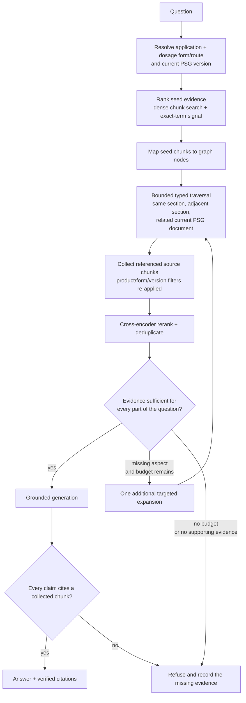

# Graph-Assisted Adaptive Retrieval

> **Status: PROPOSED runtime design; Tier-1 graph foundation landed.**
>
> Migration `0018_knowledge_graph` and `src/regwatch/store/graph_store.py`
> populate deterministic application, PSG-document, and PSG-section nodes,
> typed edges, and node-to-chunk references. No production query path reads
> those tables yet. Ask continues to use the vector retrieval path documented
> in `ARCHITECTURE.md`.

## Purpose

Improve recall when the evidence for one question is split across chunks,
sections, or current PSG documents without weakening REGWATCH's prime
directive:

> Every factual claim must cite a current, product-correct source chunk, or the
> system refuses.

The graph is a navigation index. It may find and connect candidate evidence,
but it is never evidence itself. Only source chunks remain citable.

This design specifically targets **false refusals caused by fragmented
evidence**. It does not change a correct refusal into an answer merely because
more nearby text exists.

## Current state

The current Ask path:

1. Resolves one product and, where needed, one dosage-form/route pair.
2. Restricts retrieval to the current PSG version.
3. Embeds the question and runs product-filtered pgvector cosine search.
4. Takes up to `VECTOR_TOP_K` candidates, optionally reranks them, and sends at
   most `RERANK_TOP_K` passages to synthesis.
5. Refuses before synthesis when retrieval is empty or below the configured
   threshold.
6. Validates every emitted citation against the retrieved passages.

The landed Tier-1 graph contains:

| Object | Implemented values | Purpose |
|---|---|---|
| Node | `application`, `psg_doc`, `psg_section` | Deterministic PSG hierarchy |
| Edge | `HAS_PSG`, `HAS_SECTION`, `FOLLOWS` | Product-to-document, document-to-section, and section order |
| Chunk reference | `primary`, `member` | Navigate from a node to the underlying citable chunks |

Tier 1 deliberately has no node embeddings, cross-source hubs, LLM-mined
relationships, or runtime traversal. A query embedding therefore cannot search
graph nodes directly today.

## Target query flow

The operating rule is **retrieve enough evidence within a fixed budget**, not
"retrieve as much context as possible." Unbounded traversal increases
irrelevant boilerplate, latency, token use, and the chance of blending distinct
requirements.

## Retrieval algorithm

### 1. Resolve the hard scope first

Product resolution remains outside semantic retrieval. The query must be pinned
to:

- one application;
- one normalized product;
- one dosage-form/route pair when the product has multiple forms; and
- the current PSG version or versions selected by the existing current-version
  rule.

Every graph query and every returned chunk must re-apply this scope. Graph
traversal may never cross to a different product, form, or superseded version.

### 2. Select seed evidence

The first runtime version should reuse the existing chunk embeddings rather than
introduce graph-node embeddings immediately:

1. Run the current product-filtered dense search.
2. Add an exact-term signal for application numbers, strengths, analytes,
   acronyms, named study types, and FDA terminology.
3. Keep a small set of high-recall seed chunks.
4. Map those chunks through `graph_node_chunk` to their section and document
   nodes.

Dense and exact-term retrieval solve different failure modes. Graph traversal
cannot recover from a missed entry point if neither seed method reaches the
relevant neighborhood.

Node embeddings are a later option. They become useful only when nodes carry
meaningful descriptions; embedding a generic section heading such as
"Recommendations" is weaker than embedding its source text.

### 3. Traverse typed edges with a budget

Traversal is allowlisted by edge type and query intent. The first implementation
should support:

- all `member` chunks in a matched section;
- one `FOLLOWS` hop backward and forward for boundary-spanning evidence; and
- sibling sections or current PSG documents only when the question requires
  multiple evidence components.

Starting safety limits:

| Limit | Initial value | Reason |
|---|---:|---|
| Traversal depth | 2 hops | Prevent graph fan-out |
| Expansion rounds | 2 total | Bound latency and retry-like behavior |
| Candidate chunks | 30 | Keep reranking tractable |
| Final passages | 8-12 | Bound synthesis context |
| Context budget | Explicit token cap | Avoid unbounded "more context" behavior |

These are starting values, not production truths. The evaluation harness must
select the final values.

### 4. Collect and score source chunks

Every traversed node resolves back to chunk IDs through `graph_node_chunk`.
Candidates are deduplicated by chunk ID and retain:

- seed rank and seed method;
- graph path and hop count;
- edge type and edge confidence;
- node-to-chunk reference type;
- dense, exact-term, fusion, and reranker scores;
- product, form, document, version, section, and page metadata.

The graph path is audit metadata, not a citation. The citation continues to
name the source document and page carried by the chunk.

### 5. Rerank after expansion

Graph proximity is not proof of relevance. A cross-encoder or equivalent
query-passage reranker scores the complete expanded candidate set and selects
the final passages. Path features may break ties or apply a hop penalty, but
must not override direct passage relevance.

The reranker must be a provider boundary rather than an in-process model load
in the production API. It must satisfy the same data-residency, timeout,
observability, and fallback rules as the embedding and generation providers.

### 6. Decide evidence sufficiency

The sufficiency step operates on evidence requirements, not a universal cosine
cutoff.

For a single-part question, it asks whether at least one current, scoped,
high-relevance passage directly supports an answer. For a multi-part question,
it tracks each requested aspect independently. Examples include:

- study design;
- fasting/fed condition;
- analyte;
- strength;
- endpoint or acceptance criterion; and
- whether the guidance explicitly does not specify the requested fact.

Possible outcomes:

| Outcome | Action |
|---|---|
| All requested aspects supported | Generate from the supported passages |
| A named aspect is missing and one expansion remains | Traverse only the neighborhood relevant to that aspect |
| Evidence remains incomplete | Refuse; record which aspect lacked support |
| Evidence conflicts across current sources | Refuse or clarify according to a documented conflict policy |

The sufficiency result must be logged with the candidate set and traversal
trace. It does not bypass post-generation citation validation.

## Cite-or-refuse invariants

Graph-assisted retrieval must preserve these non-negotiable rules:

1. **Chunks are the only citable unit.** Nodes, edges, generated descriptions,
   and graph paths cannot be cited as FDA evidence.
2. **Scope before traversal.** Application, product, form, route, and current
   version constraints are applied before seed retrieval and again when
   collecting chunks.
3. **Bounded traversal.** Depth, fan-out, rounds, candidate count, and context
   tokens have hard limits.
4. **Provenance on every edge and reference.** Deterministic Tier-1 edges retain
   derivation metadata; future Tier-2 edges require source-chunk provenance and
   confidence.
5. **No graph-only answer path.** Generation sees verified source chunks, never
   graph summaries alone.
6. **Post-generation validation remains authoritative.** Every answer claim
   must still map to a collected passage.
7. **One audit record per query.** Seed methods, traversal paths, expansion
   reason, sufficiency outcome, final chunks, refusal reason, and latency are
   attached to the existing authoritative query audit.
8. **Safe degradation.** If the optional graph consumer fails, the request may
   fall back to the existing scoped retrieval result only if that result
   independently passes the normal safety gates; otherwise it refuses.

## Rollout plan

### G0 - Deterministic graph foundation (landed)

- Migration `0018_knowledge_graph`.
- Tier-1 nodes, edges, and chunk references derived transactionally at chunk
  write time.
- Chunks remain the only citable unit.
- No runtime behavior change.

### G1 - Read-only traversal consumer

- Add a graph-store read API.
- Map existing dense seed chunks to section nodes.
- Expand same-section members and one adjacent section in either direction.
- Re-apply product/form/current-version filters after expansion.
- Record the traversal trace.
- Ship behind a default-off feature flag.

### G2 - Ranking and context controls

- Add the exact-term candidate signal and rank fusion.
- Add a production-safe reranker provider.
- Deduplicate and enforce candidate, passage, hop, and token budgets.
- Compare graph-assisted and baseline ranks item by item.

### G3 - Adaptive sufficiency

- Represent single- and multi-part evidence requirements.
- Add at most one targeted second expansion.
- Produce specific refusal reasons such as
  `missing_evidence:fasting_condition`.
- Keep the existing citation validator as the final authority.

### G4 - Richer deterministic graph

Only after G1-G3 show measurable value, add source-backed nodes and typed edges
for concepts already available from structured REGWATCH data, such as study
designs, analytes, conditions, requirements, Orange Book records, and SPL
sections. Each relation must point back to the source chunks or structured
source rows that justify it.

### G5 - Optional node embeddings

Add profile-versioned node-description embeddings only if evaluation shows that
chunk-seeded traversal misses useful graph entry points. A node-embedding switch
requires the same immutable profile, backfill, index-readiness, shadow, and
promotion gates as chunk embeddings.

## Evaluation and promotion gates

The current 12-item Q&A gold set is not sufficient to promote this change.
Expand it before tuning traversal or sufficiency behavior.

At minimum, compare the baseline and graph-assisted systems on:

- candidate recall at 10, 30, and 50;
- mean reciprocal rank and nDCG;
- false-refusal rate on answerable questions;
- correct-refusal rate on absent or unsupported questions;
- citation precision and fact support;
- cross-product, cross-form, and superseded-version leakage;
- graph expansion yield: relevant chunks added versus irrelevant chunks added;
- average and p95 candidate count, context tokens, retrieval latency, and total
  query latency; and
- results sliced by single-section, cross-section, multi-document, exact-term,
  numeric, acronym, and multi-part questions.

Promotion requires:

1. zero regression on product/form/version isolation;
2. no citation-precision regression;
3. a statistically credible reduction in false refusals or ranking misses;
4. latency and context budgets inside the agreed service objective;
5. a successful shadow run on representative production traffic; and
6. an instant rollback to the baseline retriever.

Do not enable graph traversal merely because the graph is populated. A ready
schema proves storage correctness, not retrieval quality.

