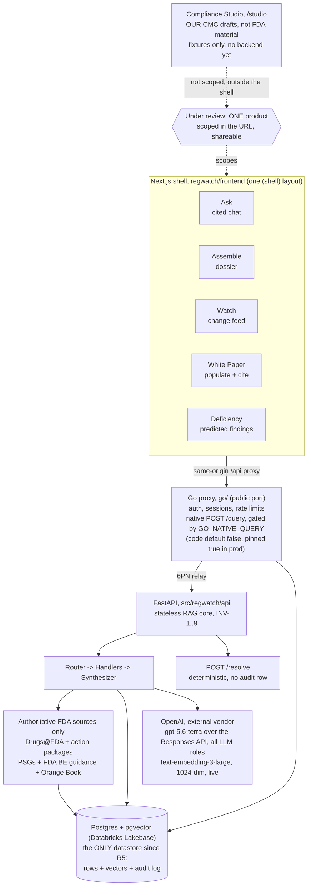

# REGWATCH - Map of Content

Last updated: 2026-08-26.

**Start here.** This is the hub: how the system fits together, plus a link to
every living doc in `docs/`, grouped by purpose.

REGWATCH watches FDA Product-Specific Guidances and other public FDA sources so a
CRA analyst can **ask cited questions, assemble dossiers, watch for changes,
populate the CRA White Paper, and predict submission deficiencies**, all scoped to
**one product under review**. It surfaces, organizes, compares, and cites. It
never authors, decides, or files. Those limits are the INV-1..9 invariants and
they are enforced as tests.

A sixth surface, the **Compliance Studio**, reads our own CMC drafts instead of
public FDA material. It is UI and domain model only, backed by fixtures.

**Read [`PRODUCTION_TRUTH.md`](PRODUCTION_TRUTH.md) next.** It is the fastest
current answer to what actually serves a request today: the live provider, the
live model, and the flag states. This page describes shape, not live values.

## How it connects

Every UI surface talks only to the **Go edge** through the same-origin `/api`
proxy. The edge serves auth, sessions, feedback, settings, and products natively,
and relays everything else to the FastAPI RAG core over Fly's private network.
It orchestrates `POST /query` itself only when `GO_NATIVE_QUERY` is on; the flag
defaults to false in code and is pinned true in `fly.toml`, so a fresh local
checkout relays that route to Python until you set it. `POST /query/stream`
always runs in Python; the Go edge only rate-limits it.

The backend resolves the product **before** retrieval and constrains retrieval to
the current PSG version, so shared FDA boilerplate cannot leak a wrong-drug or a
superseded citation. The scope bar's picker validates a product through
`POST /resolve`, which is entity resolution only: not an LLM turn, and it writes
no audit row.

The production Postgres is Databricks Lakebase, unchanged and still in-tenant.
Generation and embeddings moved from Databricks Model Serving to OpenAI
(`gpt-5.6-terra` and `text-embedding-3-large` @ 1024-dim) on 2026-08-20 by owner
decision. Model calls now leave the company tenant on every normal question;
only the database stays in-tenant. No runtime residency guard enforces
otherwise: no such check exists in `config/settings.py` or `generate/llm.py`.
See [`BUILT_BUT_DORMANT.md`](BUILT_BUT_DORMANT.md) for what was built and never
wired in, and [Section 3 of `ARCHITECTURE.md`](ARCHITECTURE.md#3-deployment-topology)
for the full topology.

The answer policy is **cite the facts, talk like a person** (v7 selective
citation, live in prod). A sentence that states what FDA guidance says must carry
the passage number it came from, and the gate drops it if it does not. Our own
reading and ordinary conversation carry no numbers. When the passages do not
answer the question, the model says so in plain words instead of a code phrase.
See [Architecture](ARCHITECTURE.md).

## The docs, by purpose

This is the only index of `docs/`. Every living doc appears exactly once below.

**Start here**

- [Project overview and quick start](../README.md)
- [Production truth](PRODUCTION_TRUTH.md) - what actually serves a query today, verified against the code
- [Non-technical guide](NON_TECH_GUIDE.md) - plain English for regulatory and business readers

**How it's built**

- [Architecture](ARCHITECTURE.md) - the canonical system design: Router, Handlers, Synthesizer, the surfaces, INV-1..9
- [Configuration reference](CONFIG_REFERENCE.md) - every environment variable, feature flag, and secret, and which layer wins
- [Built but dormant](BUILT_BUT_DORMANT.md) - code that exists but does not run: what to check before you plan work on it
- [Compliance Studio](COMPLIANCE_STUDIO.md) - `/studio`: the span-anchored finding model, the disposition record, the evidence gate behind "Fixed", and what is deliberately not built
- [Graph-assisted adaptive retrieval](GRAPH_ASSISTED_RETRIEVAL.md) - proposed bounded graph traversal from citable chunks. Tier-1 graph storage is landed, runtime traversal is not; ingest-time population was retired 2026-08-18 (CLI `graph-backfill` is the revival path)
- [Polyglot target](POLYGLOT_TARGET_2026-07-10.md) - the TS/Go/Python strangler plan, steps 0-5 done (step 8, the Rust PDF CLI, was cancelled 2026-08-19)
- [Go proxy rollout](GO_PROXY_ROLLOUT.md) - how Go took the public edge (complete)
- [Go native query rollout](GO_NATIVE_QUERY_ROLLOUT.md) - the step-5 `/query` cutover runbook, flip live 2026-07-24. `tests/test_go_native_query_pin.py` reads this file by path and pins its status line to `fly.toml`, so do not move it and do not add a second status block
- [Operating rules for Claude Code](CLAUDE.md) - hard rules and defaults

**Models and data**

- [Authoritative FDA corpus](AUTHORITATIVE_FDA_CORPUS.md) - exact five-family
  boundary, 140,438-record manifest, fingerprints, atomic ingest, embedding
  coverage, activation, rollback, and Google engineering alignment
- [Evaluation status](EVAL_STATUS.md) - current gold-set counts, CI and live evidence, and the 0.917 correction

**The web app**

- [Frontend README](../regwatch/frontend/README.md) - the Next.js shell, the surfaces, the scope picker
- [Conversational sessions](CONVERSATIONAL_SESSIONS.md) - chat sessions, follow-up context, audit rules

**The White Paper**

- [White-paper field-extraction schema](whitepaper_schema.md) - one row per template cell: {source, key, mode}

**Run and ship**

- [Docker guide](DOCKER.md) - containers, services, data mounts
- [Deploy runbook](DEPLOY.md) - Fly, Lakebase, and Vercel operations, rollback levers, restore procedure
- [CI/CD pipeline](CI_CD.md) - every CI job mapped to its local command. Read this before pushing
- [Secrets runbook](SECRETS_RUNBOOK.md) - where every secret lives and how to rotate it

**Status and what's left**

- [Roadmap](ROADMAP.md) - the single owner of open work and every production gate
- [Decisions](DECISIONS.md) - append-only log of what was picked and why
- [Security policy](../SECURITY.md)

## History

Superseded documents live in git history, not in `docs/`.
[`ROADMAP.md`](ROADMAP.md) owns every open item and every production gate.

## Documentation rules

This change established single ownership. Six documents each own one kind of
fact, named at the top of [`ROADMAP.md`](ROADMAP.md): `PRODUCTION_TRUTH.md`,
`CONFIG_REFERENCE.md`, `ARCHITECTURE.md`, `ROADMAP.md`, `BUILT_BUT_DORMANT.md`,
and `DECISIONS.md`. The rules that keep it that way:

- Every fact has exactly one owning document. Find it before you write a new
  copy.
- If your document needs a fact another document owns, write one sentence and
  link to the owner. Do not copy the value.
- Never hardcode a value that moves on a sub-monthly cadence outside its
  owning document: the Alembic head, the active embedding profile id,
  threshold values, chunk counts, Fly release numbers, or flag states.
- When a document stops being true, delete it instead of leaving it in
  `docs/` to be distrusted. Git history is the archive now.
