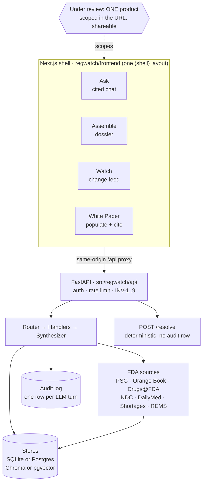

# REGWATCH — Map of Content

**Start here.** This is the hub: how the system fits together, and a link to every
living doc grouped by purpose. (Open the graph view — this note is the center.)

REGWATCH watches FDA Product-Specific Guidances and other public FDA sources, and
lets a CRA analyst **ask cited questions, assemble dossiers, watch for changes, and
populate the CRA White Paper** — all scoped to **one product under review**. It
**surfaces, organizes, compares, and cites; it never authors, decides, or files**
(the INV-1..9 invariants, enforced as tests).

## How it connects

Every UI surface talks only to the FastAPI backend through the same-origin `/api`
proxy. The backend resolves the product **before** retrieval and constrains retrieval
to the current PSG version, so shared FDA boilerplate can't leak a wrong-drug or a
superseded citation. The scope bar's picker validates a product through
`POST /resolve` (entity resolution only — not an LLM turn, writes no audit row).

## The docs, by purpose

**Start here**
- [Project overview & quick start](../README.md)
- [Non-technical guide](NON_TECH_GUIDE.md) — plain English for regulatory/business readers

**How it's built**
- [Architecture](ARCHITECTURE.md) — canonical system design (Router → Handlers → Synthesizer, the four surfaces, INV-1..9)
- [Simple technical guide](TECH_GUIDE_SIMPLE.md) — folder map and core flows
- [Project spec](PROJECT_SPEC.md) — the original build-ready spec
- [Operating rules for Claude Code](CLAUDE.md) — hard rules + defaults

**The web app**
- [Frontend README](../regwatch/frontend/README.md) — the Next.js shell, the four surfaces, the scope picker
- [Conversational sessions](CONVERSATIONAL_SESSIONS.md) — chat sessions, follow-up context, audit rules
- [Backend workspace](../regwatch/backend/README.md)

**The White Paper**
- [White-paper field-extraction schema](whitepaper_schema.md) — one row per template cell: {source, key, mode}

**Run & ship**
- [Docker guide](DOCKER.md) — containers, services, data mounts
- [Deploy runbook](DEPLOY.md) — Supabase + Fly/Railway + Vercel cutover + operations

**Status & what's left**
- [Production readiness](PROD_READINESS.md) — the prod gates, what's done vs remaining
- [Roadmap](ROADMAP.md) — the consolidated list of open / not-yet-done work
- [Decisions](DECISIONS.md) — append-only log of what was picked and why
- [Security policy](../SECURITY.md)

**History (archived, point-in-time — not current)**
- [June 8 work log](Jun8th.md) · [Codebase audit](audit_findings.md) · [Next.js migration plan](typescript-ui-replaces-streamlit-golden-pudding.md) · the `*.txt` planning notes
