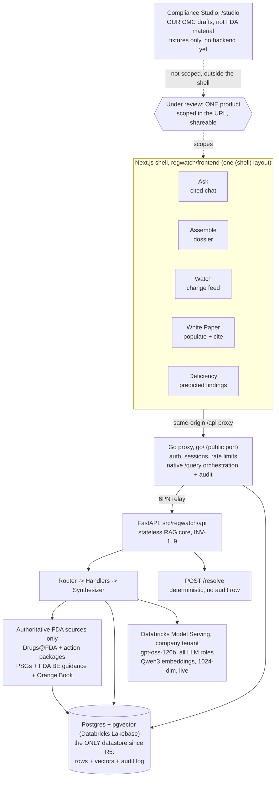

# REGWATCH - Map of Content

Last updated: 2026-08-19.

**Start here.** This is the hub: how the system fits together, plus a link to
every living doc in `docs/`, grouped by purpose.

REGWATCH watches FDA Product-Specific Guidances and other public FDA sources so a
CRA analyst can **ask cited questions, assemble dossiers, watch for changes,
populate the CRA White Paper, and predict submission deficiencies**, all scoped to
**one product under review**. It surfaces, organizes, compares, and cites. It
never authors, decides, or files. Those limits are the INV-1..9 invariants and
they are enforced as tests.

A sixth surface, the **Compliance Studio**, reads our own CMC drafts instead of
public FDA material. It is UI and domain model only, backed by fixtures.

## How it connects

Every UI surface talks only to the **Go edge** through the same-origin `/api`
proxy. The edge serves auth, sessions, feedback, settings, and products natively,
orchestrates `POST /query` and writes the audit row, and relays the rest to the
FastAPI RAG core over Fly's private network.

The backend resolves the product **before** retrieval and constrains retrieval to
the current PSG version, so shared FDA boilerplate cannot leak a wrong-drug or a
superseded citation. The scope bar's picker validates a product through
`POST /resolve`, which is entity resolution only: not an LLM turn, and it writes
no audit row.

The production Postgres is Databricks Lakebase, unchanged and still in-tenant.
Generation and embeddings moved from Databricks Model Serving to OpenAI
(`gpt-5.6-terra`, `gpt-5.6-luna` since 2026-08-26, and `text-embedding-3-large`
@ 1024-dim) on 2026-08-20 by
owner decision, which deliberately reopens the D1 data-residency question for
those two legs -- the database leg stays in-tenant. `D1_ENFORCED` was never set
in prod, so no armed guard was bypassed. See [Section 2 of
`ARCHITECTURE.md`](ARCHITECTURE.md#2-deployment-topology).

The answer policy is **cite the facts, talk like a person** (v7 selective
citation, live in prod). A sentence that states what FDA guidance says must carry
the passage number it came from, and the gate drops it if it does not. Our own
reading and ordinary conversation carry no numbers. When the passages do not
answer the question, the model says so in plain words instead of a code phrase.
See [Architecture](ARCHITECTURE.md).

## The docs, by purpose

This is the only index of `docs/`. Every living doc appears exactly once below.

**Start here**

- [Project overview and quick start](../README.md)
- [Non-technical guide](NON_TECH_GUIDE.md) - plain English for regulatory and business readers
- [Simple technical guide](TECH_GUIDE_SIMPLE.md) - folder map and core flows

**How it's built**

- [Architecture](ARCHITECTURE.md) - the canonical system design: Router, Handlers, Synthesizer, the surfaces, INV-1..9
- [Compliance Studio](COMPLIANCE_STUDIO.md) - `/studio`: the span-anchored finding model, the disposition record, the evidence gate behind "Fixed", and what is deliberately not built
- [Graph-assisted adaptive retrieval](GRAPH_ASSISTED_RETRIEVAL.md) - proposed bounded graph traversal from citable chunks. Tier-1 graph storage is landed, runtime traversal is not; ingest-time population was retired 2026-08-18 (CLI `graph-backfill` is the revival path)
- [Polyglot target](POLYGLOT_TARGET_2026-07-10.md) - the TS/Go/Python strangler plan, steps 0-5 done (step 8, the Rust PDF CLI, was cancelled 2026-08-19)
- [Go proxy rollout](GO_PROXY_ROLLOUT.md) - how Go took the public edge (complete)
- [Go native query rollout](GO_NATIVE_QUERY_ROLLOUT.md) - the step-5 `/query` cutover runbook, flip live 2026-07-24. `tests/test_go_native_query_pin.py` reads this file by path and pins its status line to `fly.toml`, so do not move it and do not add a second status block
- [Project spec](PROJECT_SPEC.md) - the original build-ready spec. Current-state docs win where they conflict
- [Operating rules for Claude Code](CLAUDE.md) - hard rules and defaults

**The answer layer**

- [Prompt-layer research](PROMPT_LAYER_RESEARCH_2026-08-07.md) - the research behind selective citation, clarification, and SLM prompting
- [slm-layer execution plan](SLM_LAYER_IMPLEMENTATION_PLAN_2026-08-07.md) - the PR-by-PR plan that delivered v6 prose and v7 selective citation
- [Ask live-draft design](superpowers/specs/2026-08-10-ask-sse-live-draft-design.md) - the provisional-draft SSE channel and the INV-1 amendment that allows it
- [Ask live-draft plan](superpowers/plans/2026-08-10-ask-sse-live-draft.md) - the build plan for that channel

**Models and data**

- [Authoritative FDA corpus](AUTHORITATIVE_FDA_CORPUS.md) - exact five-family
  boundary, 140,438-record manifest, fingerprints, atomic ingest, embedding
  coverage, activation, rollback, and Google engineering alignment
- [Databricks adoption](DATABRICKS_ADOPTION_2026-07-28.md) - the inference-plane decision, cost model, incident log, and rollout state
- [Evaluation status](EVAL_STATUS.md) - current gold-set counts, CI and live evidence, and the 0.917 correction

**The web app**

- [Frontend README](../regwatch/frontend/README.md) - the Next.js shell, the surfaces, the scope picker
- [Conversational sessions](CONVERSATIONAL_SESSIONS.md) - chat sessions, follow-up context, audit rules

**The White Paper**

- [White-paper field-extraction schema](whitepaper_schema.md) - one row per template cell: {source, key, mode}

**Run and ship**

- [Docker guide](DOCKER.md) - containers, services, data mounts
- [Deploy runbook](DEPLOY.md) - Fly, Lakebase, and Vercel operations, rollback levers, restore procedure
- [CI/CD pipeline](CI_CD.md) - every CI job mapped to its local command. Read this before pushing
- [Secrets runbook](SECRETS_RUNBOOK.md) - where every secret lives and how to rotate it
- [Provider triage](PROVIDER_TRIAGE.md) - is the Databricks embedding/LLM endpoint actually serving? Read before concluding one is missing

**Status and what's left**

- [Production readiness](PROD_READINESS.md) - the prod gates, what is done and what remains
- [Roadmap](ROADMAP.md) - the consolidated list of open work
- [Decisions](DECISIONS.md) - append-only log of what was picked and why
- [Security policy](../SECURITY.md)

**History**

[`archive/`](archive/) holds point-in-time audits, completed rollout plans, and
superseded reviews. Treat everything in it as history: never read an archived
blocker as open. `ROADMAP.md` and `PROD_READINESS.md` own open work.

Six docs moved to `archive/` on 2026-08-11 because the questions they were
written to answer have since been settled:

- [`archive/DATA_RESIDENCY_D1.md`](archive/DATA_RESIDENCY_D1.md) - D1 was closed 2026-07-30 through 2026-08-19 (generation, embeddings, and the database all in-tenant). As of 2026-08-20 it is deliberately reversed for the model-call legs by owner decision: generation and embeddings moved to OpenAI. The database leg is unchanged and still in-tenant
- [`archive/OPEN_MODEL_ROLLOUT.md`](archive/OPEN_MODEL_ROLLOUT.md) - the embedding-profile rollout finished on 2026-07-30
- [`archive/THRESHOLD_VALIDATION_2026-06-25.md`](archive/THRESHOLD_VALIDATION_2026-06-25.md) - the 0.30 refusal threshold. Still unvalidated against the current vector space, tracked in `ROADMAP.md`
- [`archive/WHITEPAPER_RUNS_PHASE2_DESIGN.md`](archive/WHITEPAPER_RUNS_PHASE2_DESIGN.md) - saved runs and the analyst overlay, shipped
- [`archive/REFACTOR_BACKLOG_2026-07-09.md`](archive/REFACTOR_BACKLOG_2026-07-09.md) - the 120-item working list from July
- [`archive/STEP5_INV_TEST_MAPPING.md`](archive/STEP5_INV_TEST_MAPPING.md) - INV-by-INV test coverage across the Go/Python boundary at the step-5 cutover

## Documentation rules

- Keep `../README.md` short. Detailed operational docs live here in `docs/`.
- New architecture decisions go in `DECISIONS.md`, not only in chat.
- If a doc says something is production-ready, include the evidence that proves it.
- If a change touches Docker, deploy, ingest, or source-handler behavior, update
  `DOCKER.md`, `DEPLOY.md`, and `TECH_GUIDE_SIMPLE.md` in the same change.
- If you change `.github/workflows/ci.yml` (add or remove a job or step, change a
  gating command, or add a vuln suppression), update `CI_CD.md` in the same change
  so the pre-push checklist never drifts from the real gate.
- When a doc stops being true, move it to `archive/` with a banner saying what
  replaced it, and fix every link that pointed at it. Do not leave a stale plan
  sitting in `docs/` where it reads as current.
