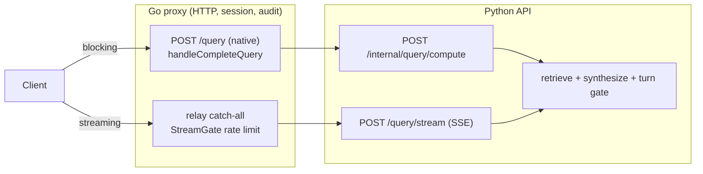

# Production truth

What actually serves a query in production, in five minutes.
Every claim below cites the file and symbol that proves it; when this page and
a code comment disagree, trust the code and fix the comment.

## Request paths

## 1. Query serving

Go owns HTTP, sessions, and audit for the blocking path.
`GO_NATIVE_QUERY` is pinned `"true"` in `fly.toml`, which makes
`go/internal/api/routes.go` register `POST /query` to `handleCompleteQuery`
in `go/internal/api/query.go`.
That handler does gates, rate limiting, and audit writes, then calls Python
`POST /internal/query/compute` (`src/regwatch/api/main.py`), which owns the
actual RAG work: retrieve, synthesize, gate.

## 2. Streaming

`POST /query/stream` is Python-only (`src/regwatch/api/main.py`).
No Go route for it exists even with `GO_NATIVE_QUERY` on; it rides the relay
catch-all to Python.
Go still fronts it with a pre-relay gate, `StreamGate` in
`go/internal/api/query_stream_gate.go`, but that gate only rate-limits; it
never serves the response.

## 3. Retrieval (serving arm)

`ACTIVE_EMBEDDING_PROFILE` picks the serving arm in
`src/regwatch/retrieve/retriever.py`.
The value `"legacy"` uses the `EMBEDDING_PROVIDER` env provider and reads
`chunk.embedding` via `similarity_search`
(`src/regwatch/store/pgvector_store.py`).
A named profile resolves its profile row and reads `chunk_embedding` joined
to `chunk` via `similarity_search_profile`
(`src/regwatch/store/embedding_profiles.py`).
Prod runs a named Qwen3 profile, so prod retrieval reads
`chunk_embedding JOIN chunk` and never consults `EMBEDDING_PROVIDER` at
serve time.

## 4. Ingestion (write arm)

`EMBEDDING_PROVIDER` still governs every embedding write.
`src/regwatch/ingest/pipeline.py` and `src/regwatch/corpus/sync.py` both call
`get_embedding_provider()` (`src/regwatch/process/embedder.py`) to embed new
chunks, so ingest and backfill runs need that env var even though the named
serving profile ignores it.

## 5. Final answer

The turn gate's rendering is the canonical answer.
`src/regwatch/generate/grounded_qa.py` captures the raw model draft, but the
response carries `rendered_answer = tg.render_answer(admitted)`
(`src/regwatch/generate/turn_gate.py`); that is the only place model bytes
become user-visible text.
Streaming `draft` SSE frames (behind `REGWATCH_LIVE_DRAFT`) are un-gated
provisional bytes; when the gated result refuses, the stream withdraws them
with a `draft_withdrawn` marker (`src/regwatch/api/main.py`).

## 6. Corpus

There is ONE shared `chunk` table.
Legacy PSG rows have `source_family` NULL; authoritative FDA corpus rows
(migrations 0023-0025, `src/regwatch/corpus/`) carry a `source_family` value.
The cutover flag `REGWATCH_RETRIEVAL_CORPUS` (`retrieval_corpus` in
`config/settings.py`) defaults to `"legacy"`, so prod retrieval scopes to the
legacy PSG rows until it is flipped to `"authoritative_fda"`.

## 7. Graph

`graph_node`, `graph_edge`, and `graph_node_chunk` (migration 0018,
`src/regwatch/store/graph_store.py`) are populated by ingest
(`src/regwatch/ingest/pipeline.py`) and by the `graph-backfill` CLI command
(`src/regwatch/cli.py`).
Nothing reads them at runtime: `src/regwatch/api/`, `src/regwatch/retrieve/`,
and `src/regwatch/generate/` contain zero readers.
As of this page the graph is write-only.

## 8. Studio

Most of the Studio surface is frontend fixtures with no network calls:
the working draft documents (`DOCS`), repository tree (`TREE`), findings
(`CHECK_RESULTS`, applied after a fake delay), and the canned assistant
replies all live in `regwatch/frontend/lib/studio-fixtures.ts` and
`regwatch/frontend/app/studio/page.tsx`.
Backend-real parts: the PSG reference rail
(`GET /psg/documents` plus `/pdf`, `/content`, `/docx`, `/requirements` in
`src/regwatch/api/main.py`), `POST` and `GET /studio/check`, reference-PSG
checks, and the Ask Q&A the page routes through `askQuery`.

## 9. Audit semantics

The audit table is `query_log`; no `audit_log` table exists.
Writers are `log_query` (`src/regwatch/common/audit.py`) behind the choke
points `_persist_turn` (`src/regwatch/generate/grounded_qa.py`) and
`persistTurn` / `InsertQueryLog` (`go/internal/api/query.go`,
`go/internal/store/`).
Never write "/query always audits"; the honest contract is:

*   An accepted query attempts a `query_log` write.
*   Audit-store failure: the request may still succeed, returning HTTP 200
    with `audit_id: -1` and NO row (contract tests S16/S26).
*   Pre-pipeline rejection (401/404/422/429): no row.
*   Saturation shed (503): no row in Python, but Go currently commits the T1
    user message BEFORE the shed (`go/internal/api/query.go`, the "divergence"
    comment; `tests_contract/test_query_failure_audit.py` S27) -- a known
    divergence under repair.
*   `/resolve` never writes `query_log`, on success or failure
    (`tests/test_resolve_api.py`).

## 10. Boot requirements

The API lifespan (`_lifespan` in `src/regwatch/api/main.py`) refuses to boot
when `DATABASE_URL` is unset (`src/regwatch/store/db.py`) or when
`EMBEDDING_PROVIDER` is unset.
A blank provider env var counts as unset
(`_normalize_optional_provider_value` in `config/settings.py`).
`LLM_PROVIDER` unset does NOT block boot today; it fails lazily at the first
generation call (`get_llm_provider` in `src/regwatch/generate/llm.py`).
A change to fail at startup instead is in flight in a parallel work stream;
until it lands, lazy failure is the current truth.
