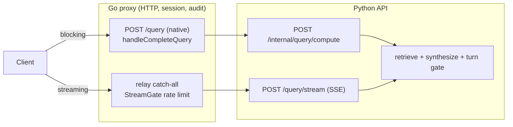

# Production truth

Last verified 2026-08-26 against `origin/main` at `0a13c4a`.

What actually serves a query in production, in five minutes.
Every claim below cites the file and symbol that proves it; when this page and
a code comment disagree, trust the code and fix the comment.

## Request paths



## 1. Query serving

Go owns HTTP, sessions, and audit for the blocking path.
`GO_NATIVE_QUERY` is pinned `"true"` in `fly.toml`, which makes
`go/internal/api/routes.go` register `POST /query` to `handleCompleteQuery`
in `go/internal/api/query.go`.
That handler does gates, rate limiting, and audit writes, then calls Python
`POST /internal/query/compute` (`src/regwatch/api/main.py`), which owns the
actual RAG work: retrieve, synthesize, gate.

## 2. Streaming

`POST /query/stream` is Python-only (`src/regwatch/api/main.py`).
No Go route for it exists even with `GO_NATIVE_QUERY` on; it rides the relay
catch-all to Python.
Go still fronts it with a pre-relay gate, `StreamGate` in
`go/internal/api/query_stream_gate.go`, but that gate only rate-limits; it
never serves the response.

## 3. Retrieval (serving arm)

`RETRIEVAL_EMBEDDING_PROFILE` (Settings field `active_embedding_profile`)
picks the serving arm in `src/regwatch/retrieve/retriever.py`.
The old name `ACTIVE_EMBEDDING_PROFILE` still works as an alias and logs a
`FutureWarning`; when both are set, the new name wins.
`config/settings.py:113-118`.
The value `"legacy"` uses the `INGEST_EMBEDDING_PROVIDER` env provider and
reads `chunk.embedding` via `similarity_search`
(`src/regwatch/store/pgvector_store.py`).
A named profile resolves its profile row and reads `chunk_embedding` joined
to `chunk` via `similarity_search_profile`
(`src/regwatch/store/embedding_profiles.py`).
Prod runs an OpenAI `text-embedding-3-large` profile at 1024 dimensions,
named by the `RETRIEVAL_EMBEDDING_PROFILE` Fly secret (`fly.toml:59-65`), so
prod retrieval reads `chunk_embedding JOIN chunk` and never consults
`INGEST_EMBEDDING_PROVIDER` at serve time.
Run `regwatch status` to print the profile actually in force on the machine
you run it on; this page cannot print the live secret value.

## 4. Ingestion (write arm)

`INGEST_EMBEDDING_PROVIDER` (Settings field `embedding_provider`, old alias
`EMBEDDING_PROVIDER`) still governs every embedding write.
`src/regwatch/ingest/pipeline.py` and `src/regwatch/corpus/sync.py` both call
`get_embedding_provider()` (`src/regwatch/process/embedder.py`) to embed new
chunks, so ingest and backfill runs need that env var even though the named
serving profile ignores it. `config/settings.py:87-95`.

## 5. Final answer

The turn gate's rendering is the canonical answer.
`src/regwatch/generate/grounded_qa.py` captures the raw model draft, but the
response carries `rendered_answer = tg.render_answer(admitted)`
(`src/regwatch/generate/turn_gate.py`); that is the only place model bytes
become user-visible text.
Streaming `draft` SSE frames (behind `REGWATCH_LIVE_DRAFT`) are un-gated
provisional bytes; when the gated result refuses, the stream withdraws them
with a `draft_withdrawn` marker (`src/regwatch/api/main.py`).

## 6. Corpus

There is ONE shared `chunk` table.
Legacy PSG rows have `source_family` NULL; authoritative FDA corpus rows
(migrations 0023-0025, `src/regwatch/corpus/`) carry a `source_family` value.
The cutover flag `REGWATCH_RETRIEVAL_CORPUS` (`retrieval_corpus` in
`config/settings.py`) defaults to `"legacy"`, so prod retrieval scopes to the
legacy PSG rows until it is flipped to `"authoritative_fda"`.

## 7. Graph

`graph_node`, `graph_edge`, and `graph_node_chunk` (migration 0018,
`src/regwatch/store/graph_store.py`) have one write path: the `graph-backfill`
CLI command (`src/regwatch/cli.py:1043`), which calls `derive_document_graph`
directly.
Ingest-time population was retired; `src/regwatch/ingest/pipeline.py` has no
graph call left in it.
Nothing reads the graph tables at runtime: `src/regwatch/api/`,
`src/regwatch/retrieve/`, and `src/regwatch/generate/` contain zero readers.
As of this page the graph is write-only, and the only way to write it is to
run the CLI command by hand.

## 8. Studio

Studio is a three-way split. Do not describe it as "fixtures only" and do
not re-derive this split in another doc; link here.

1. Frontend fixtures, no network calls: the working draft documents (`DOCS`),
   repository tree (`TREE`), findings (`CHECK_RESULTS`, applied after a fake
   delay), and the canned assistant replies all live in
   `regwatch/frontend/lib/studio-fixtures.ts` and are read directly by
   `regwatch/frontend/app/studio/page.tsx`.
2. Real backend, not yet called from the page: `POST /studio/check` and
   `GET /studio/check/{run_id}` (`src/regwatch/api/main.py:2839,2876`) run a
   real analysis in the background (`run_studio_check`,
   `src/regwatch/deficiency/runner.py:52`) and persist a DB-backed run row.
   `regwatch/frontend/app/studio/page.tsx:62` says so in its own comment: the
   endpoint "exists but is not wired here yet".
3. Real backend, called live: the PSG reference rail
   (`GET /psg/documents` plus `/pdf`, `/content`, `/docx`, `/requirements`,
   `src/regwatch/api/main.py:23-28`) and the Ask Q&A panel, which the page
   calls through `askQuery` (`regwatch/frontend/app/studio/page.tsx:25,600`).

## 9. Audit semantics

The audit table is `query_log`; no `audit_log` table exists.
Writers are `log_query` (`src/regwatch/common/audit.py`) behind the choke
points `_persist_turn` (`src/regwatch/generate/grounded_qa.py`) and
`persistTurn` / `InsertQueryLog` (`go/internal/api/query.go`,
`go/internal/store/`).
Never write "/query always audits"; the honest contract is:

- An accepted query attempts a `query_log` write.
- Audit-store failure: the request may still succeed, returning HTTP 200
  with `audit_id: -1` and NO row (contract tests S16/S26).
- Pre-pipeline rejection (401/404/422/429): no row.
- Saturation shed (503): no row in Python. Go commits the T1 user message
  before the shed is known, then compensates by deleting it (and the session
  row, if this turn created it) before responding, so both runtimes converge on
  zero rows. See `compensateShedTurn` in `go/internal/api/query.go` and
  contract test S27 in `tests_contract/test_query_failure_audit.py`. The
  compensation is best effort: a failure there leaves an orphan T1.
- `/resolve` never writes `query_log`, on success or failure
  (`tests/test_resolve_api.py`).

## 10. Boot requirements

The API lifespan (`_lifespan` in `src/regwatch/api/main.py:174`) refuses to
boot when any of `DATABASE_URL` (`src/regwatch/store/db.py`),
`INGEST_EMBEDDING_PROVIDER`, or `LLM_PROVIDER` is unset.
A blank provider env var counts as unset
(`_normalize_optional_provider_value` in `config/settings.py:268`).
`assert_embedding_runtime_available(s.embedding_provider)` and
`assert_llm_runtime_available(s.llm_provider)` both run inside the lifespan,
before the app starts serving (`src/regwatch/api/main.py:214,221`).
An unset or misconfigured `LLM_PROVIDER` refuses at boot; it does not fail
lazily on the first generation call. If you see a doc or comment claiming
otherwise, it is describing a state that no longer exists in this codebase.

## 11. Database schema

The Alembic head in this checkout is `0027_chunk_filter_indexes`
(`migrations/versions/0027_chunk_filter_indexes.py`, `down_revision =
"0026_ingredient_chemistry"`).
Do not hardcode this number anywhere else in the doc set; the checkout moves
and this page is the one place it is allowed to say so.
To read the stamp a running database actually carries, run:

```bash
uv run alembic current
```

Boot refuses if the live stamp does not match the code's head
(`docker/entrypoint.sh`, `src/regwatch/store/db.py`), so a healthy process is
proof the two already match.

## 12. Live models and API surface

Generation and embeddings both call OpenAI directly; the database is the
only datastore that stays in the company tenant.

- LLM: `gpt-5.6-terra` (`openai_llm_model`, `config/settings.py:155`), called
  through the OpenAI **Responses API** (`client.responses.create`,
  `store=False`), not Chat Completions.
  `src/regwatch/generate/llm.py:604,533-549`.
  One model serves every role: router, synthesizer, extractor.
- Reasoning effort: `openai_reasoning_effort`, default `"medium"`, one global
  value, not per-role. `config/settings.py:156`, `llm.py:553-554`.
- Embeddings: `text-embedding-3-large`, truncated to 1024 dimensions with the
  API's `dimensions` parameter. `config/settings.py:157,161`,
  `src/regwatch/process/embedder.py:28-34`.
- Setting `LLM_PROVIDER` to `databricks` raises `ValueError` (`llm.py:732-733`).
  There is no Databricks LLM rollback path in this codebase. Only two embedding
  provider classes exist, `EchoEmbeddingProvider` and
  `OpenAIEmbeddingProvider` (`embedder.py:203,282`); there is no Qwen3 class
  and no local bge path either.

## 13. Flags pinned in fly.toml

Each of these differs between its `fly.toml` pin and its code default. State
both when you describe one; a reader running locally with no `[env]` block
gets the code default and will be surprised if you only give the prod value.

| Flag | `fly.toml` pin | Code default |
|---|---|---|
| `GO_NATIVE_QUERY` | `"true"` (`fly.toml:98`) | `false` (`go/internal/api/config.go:209`) |
| `REGWATCH_ROUTE_CALL` | `"off"` (`fly.toml:74`) | `"off"` (`config/settings.py:190-192`) |
| `REGWATCH_PROSE_SYNTHESIS` | `"true"` (`fly.toml:110`) | `false` (`config/settings.py:173-175`) |
| `REGWATCH_SELECTIVE_CITATION` | `"true"` (`fly.toml:111`) | `false` (`config/settings.py:212-214`) |

A Fly secret of the same name still overrides the `[env]` pin, so the
incident-rollback lever for the last three is `fly secrets set
<FLAG>=false -a amneal`, no deploy needed. `fly.toml:91-111` documents this
precedence in its own comments.
`REGWATCH_ROUTE_CALL` has three modes (`off`, `shadow`, `live`); live mode is
implemented (`src/regwatch/generate/grounded_qa.py:2477-2498`, product scope
only) but does not run in prod today.

## 14. How to re-verify this page

Each numbered claim above traces to a command you can run from a checkout of
this repo. Re-running all of these takes about ten minutes.

```bash
# Alembic head vs live stamp (section 11)
uv run alembic current
grep -n "down_revision" migrations/versions/*.py | tail -3

# Flag defaults and pins (section 13)
grep -n "GO_NATIVE_QUERY\|REGWATCH_ROUTE_CALL\|REGWATCH_PROSE_SYNTHESIS\|REGWATCH_SELECTIVE_CITATION" fly.toml
grep -n "route_call_mode\|prose_synthesis_enabled\|selective_citation_enabled" config/settings.py
grep -n "GoNativeQuery bool\|EnvBool(\"GO_NATIVE_QUERY\"" go/internal/api/config.go

# Env var names and aliases (sections 3, 4)
grep -n "AliasChoices" config/settings.py

# Boot behavior (section 10)
grep -n "assert_llm_runtime_available\|assert_embedding_runtime_available" src/regwatch/api/main.py

# Graph write path (section 7)
grep -n "graph-backfill\|derive_document_graph" src/regwatch/cli.py
grep -n "graph" src/regwatch/ingest/pipeline.py

# Studio split (section 8)
grep -n "askQuery\|CHECK_RESULTS\|not wired here yet" regwatch/frontend/app/studio/page.tsx

# Live provider settings on a running process, no secrets printed
uv run regwatch status
```

Every fact this page states as prod-live but cannot prove from a static
checkout (the resolved per-profile refusal threshold, the current Fly release
number, live row counts) is deliberately left as a command to run, not a
number to trust. If a number you need is not here, that is why: read it from
the running system, then update this page instead of copying it elsewhere.
